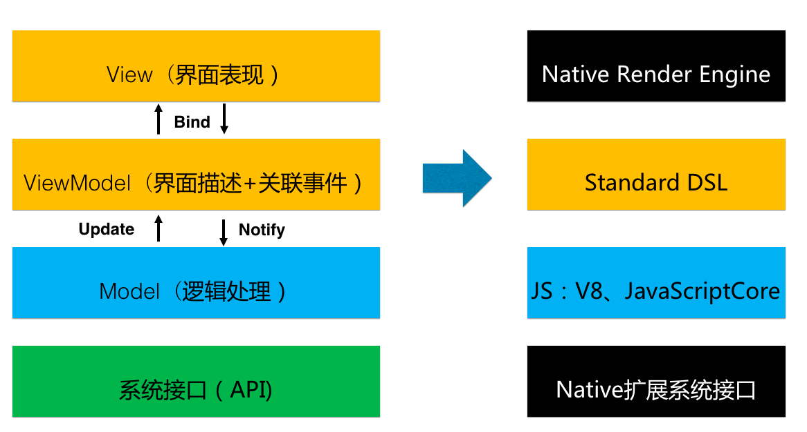
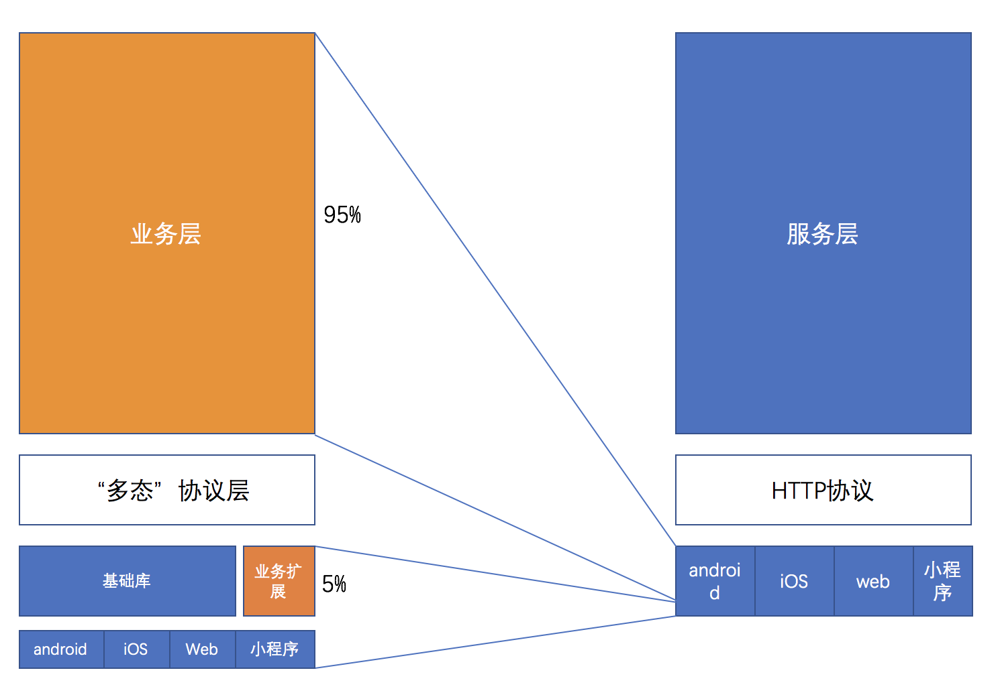

# 介绍

**Chameleon**/kəˈmiːlɪən/，简写`CML`，中文名`卡梅龙`；中文意思`变色龙`，意味着就像变色龙一样能适应不同环境的跨端整体解决方案。


## 背景
研发同学在端内既追求h5的灵活性，也要追求性能趋近于原生。
面对入口扩张，主端、独立端、微信小程序、支付宝小程序、百度小程序、Android厂商联盟快应用，单一功能在各平台都要重复实现，开发和维护成本成倍增加。迫切需要维护一套代码可以构建多入口的解决方案，历经近20个月打磨，滴滴跨端解决方案Chameleon终于发布。真正专注于让一套代码运行多端，期望提供标准的MVVM模式统一各类MVVM终端。


## 设计理念

Chameleon 希望既能用一套代码完成所有端需求，将相同的业务逻辑完成收敛到同一层系统里面，又避免因项目的抽象归一而导致可维护性变差。

### 跨端架构

虽然不同各端环境千变万化，但万变不离其宗的是 [MVVM](https://zh.wikipedia.org/zh-hans/MVVM) 架构思想，**Chameleon 目标是让MVVM跨端环境大统一**。



### 可维护性问题

软件架构设计里面最基础的概念“拆分”和“合并”，拆分的意义是“分而治之”，将复杂问题拆分成单一问题解决，比如后端业务系统的”微服务化“设计；“合并”的意义是将同样的业务需求收敛到一块，达成高效率高质量的目的，例如后端业务系统中的“中台服务”设计。

而 Chameleon 属于后者，通过定义统一的语言框架+统一多态协议，从多端（对应多个独立服务）业务中抽离出自成体系、连续性强、可维护强的“前端中台服务”，这里的”服务“上游是后端的前台服务。

统一多态协议设计的灵感来自于[Apache Thrift - 可伸缩的跨语言服务开发框架](https://zh.wikipedia.org/zh-hans/Thrift)，本质上跨端也属于跨语言。
**它能让Chameleon开发者快速接入各个客户端底层功能，且不会因为各端接口差异、产品需求差异导致正常业务代码被打散，变得可读性差、难以维护，避免结果适得其反**，[具体Case](./example/chameleon-product-diff.html)；各个客户端底层功能实现可以一部分来自Chameleon提供的基础组件和基础api库，一部分来自chameleon开发者，一部分来自各端生态开源库（Chameleon拥抱开源社区，你可以直接安装某个端的组件在使用多态协议扩展到某个端使用）。




## 学习全景图


## 开发语言
从事过网页编程的人知道，网页编程采用的是HTML + CSS + JS这样的组合，同样道理，chameleon中采用的是 CML + CMSS + JS。
[JS](./logic/lifecycle.html)语法用于处理页面的逻辑部分，与普通网页编程相比，本项目目标定义标准MVVM框架，拥有完整的生命周期，watch，computed，数据双向绑定等优秀的特性，能够快速提高开发速度、降低维护成本。 简单举例：
```javascript
<script>
class Index {
  // data
  data =  {
    message: 'Hello',
  }
  // 计算属性
  computed = {
    reversedMessage: function () {
      return this.message.split('').reverse().join('')
    }
  }
  // 观察数据变化
  watch: {
    message: function (newV, oldV) {
    }
  }
  // 各种生命周期
  mounted: function(res) {
  }
}
export new Index();
</script>
```

[CML](./view/cml.html)（Chameleon Markup Language）用于描述页面的结构，我们知道HTML是有一套标准的语义化标签，例如文本是`<span>` 按钮是`<button>`。CML同样具有一套标准的标签，我们将标签定义为`组件`，CML为用户提供了一系列[组件](./component/base/base.html)。同时CML中还支持<b>模板语法</b>，例如条件渲染、列表渲染，数据绑定等等。简单举例：

```html
<template>
  <view> 
     <!--数据绑定 message变量 -->
      <text>
        {{ message }}
      </text> 
  </view>
</template>

```
同时，CML支持使用[类VUE语法](./view/vue.html)，让你更快入手。


[CMSS](./view/cmss.html)(Chameleon Style Sheets)用于描述CML页面结构的样式语言，其具有大部分CSS的特性，并且还可以支持各种css的预处语言`less stylus`。 默认支持less处理，简单举例：
```html
<style>
@import './global.less';
@size: 10px;
.header {
  width: @size;
  height: @size;
}
</style>
```

<b>通过以上对于开发语言的介绍，相信你看到只要是有过网页编程知识的人都可以快速的上手chameleon的开发</b>。


## [丰富的组件](./component/component.html)
在用CML写页面时，chameleon提供了丰富的组件供开发者使用，内置的有`button switch radio checkbox`等组件，扩展的有`c-picker c-dialog c-loading`等等,覆盖了开发工作中常用的组件。 具体参见[组件](./component/component.html)。
组件也提供了可定制化属性，与事件，让组件展示不同的状态，或响应不同的事件，简单举例：

```html
<button
  color="blue"
  text="确定"
  disabled="{{true}}"
  c-bind:onclick="testclick" >
</button>
```
`color`属性控制按钮的颜色，`text`属性控制按钮的文本，`disabled`属性按钮是否禁用，` c-bind:onclick` 绑定点击的事件的处理方法。

用户也可以封装业务组件进行复用。


## [丰富的API](./api/api.html)

为了方便开发者的高效开发，chameleon提供了丰富的API库,发布为npm包`chameleon-api`，里面包括了网络请求、数据存储、地理位置、系统信息、动画等方法。使用方式如下：

```javascript
import cml from 'chameleon-api'

cml.showToast({
  message: JSON.stringify(res),
  duration: 2000
});
```
## [自由定制API和组件](./framework/polymorphism/intro.html)
基于强大的多态组件协议，可自由扩展任意API和组件，不强依赖框架的更新。
代码扩展`setStorage`方法，各端各自实现充分隔离：
```html
<script cml-type="interface">
// 定义模块的interface
interface UtilsInterface {
  // 定义setStorage方法 参数个数及返回值类型
  setStorage(key: string, value: string): undefined;
}
</script>
<script cml-type="web">
// web端接口实现
class Method implements UtilsInterface {
  setStorage(key, value, cb) {
    localStorage.setItem(key, value);
  }
}
export default new Method();
</script>
<script cml-type="weex">
// weex端接口实现
class Method implements UtilsInterface {
  setStorage(key, value) {
    storage.setItem(key, value);
  }
}
export default new Method();
</script>
<script cml-type="wx">
// wx端接口实现
class Method implements UtilsInterface {
  setStorage(key, value) {
      wx.setStorageSync(key, value);
  }
}
export default new Method();
</script>

```
所以各端原始项目中已积累大量组件，也能直接引入到跨端项目里面使用。
## [智能规范校验](./framework/polymorphism/check.html)
代码规范校验，当出现不符合规范要求的代码时，编辑器会展示智能提示，不用挨个调试各端代码，同时命令行启动窗口也会提示代码的错误位置。

## [渐进式跨端](./framework/progressive.html)
既想一套代码运行多端，又不用大刀阔斧的重构项目，可以将多端重用组件用Chameleon开发，直接在原有项目里面调用。

## [先进前端开发体验](./framework/framework.html)

Chameleon 不仅仅是跨端解决方案。基于优秀的前端打包工具Webpack，吸收了业内多年来积累的最有用的工程化设计，提供了前端基础开发脚手架命令工具，帮助端开发者从开发、联调、测试、上线等全流程高效的完成业务开发。

## 联系我们

[ChameleonCore@didiglobal.com](mailto:ChameleonCore@didiglobal.com)

## 钉钉交流群

