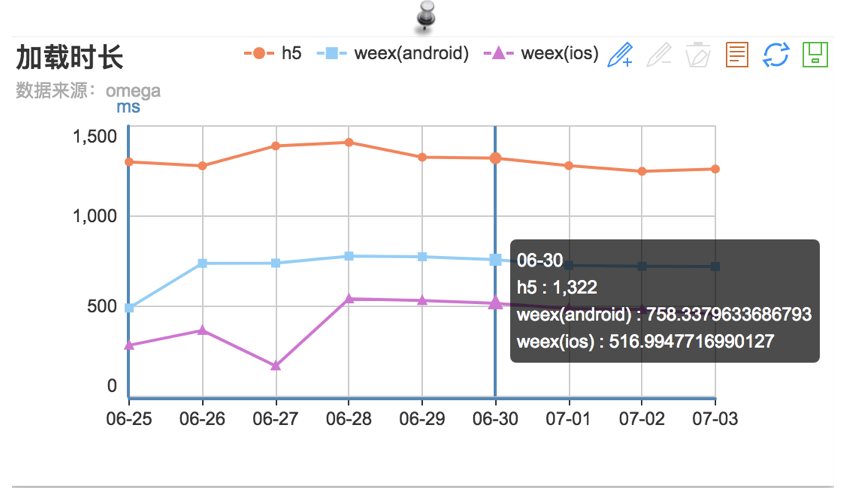

# 目前Chameleon的性能统计方式是Omega埋点。

#### bts_weex_container_load_time
记录从创建页面至渲染完成的耗时。
#### bts_weex_container_render_time
记录从开始加载（传递参数至weex）至渲染完成的耗时。
#### bts_weex_container_exception
记录渲染失败、出错、H5主动通知降级。

和WebView对比，性能统计对比图

