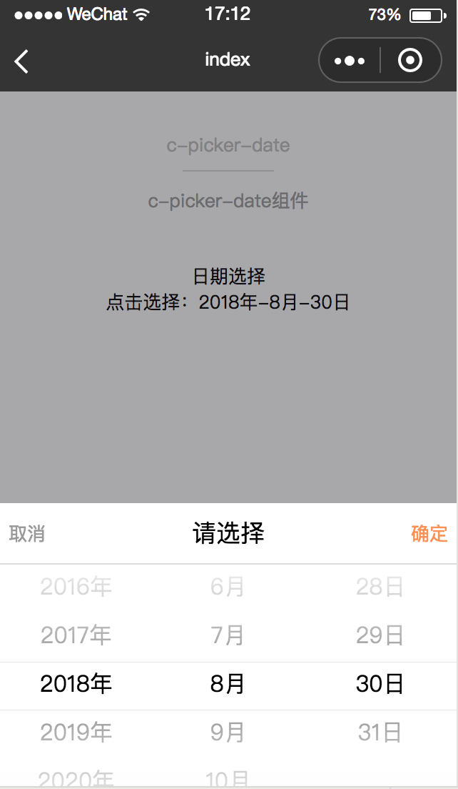

# c-picker-date

---

日期选择器

###属性

<table>
  <tr>
    <th>属性名</th>
    <th>类型</th>
    <th>必填</th>
    <th>默认值</th>
    <th>说明</th>
  </tr>
  <tr>
    <td>data</td>
    <td>Array</td>
    <td>是</td>
    <td></td>
    <td>滚动选择器滚动的数据</td>
  </tr>
  <tr>
    <td>default-index</td>
    <td>Number</td>
    <td>是</td>
    <td>0</td>
    <td>滚动选择器默认的数据索引</td>
  </tr>
  <tr>
    <td>height</td>
    <td>String</td>
    <td>是</td>
    <td>“400”</td>
    <td>滚动选择器的高度</td>
  </tr>
  <tr>
    <td>text-align</td>
    <td>String</td>
    <td>是</td>
    <td>"center"</td>
    <td>滚动选择器的文本样式:"居中"</td>
  </tr>
  <tr>
    <td>c-bind:selectchange</td>
    <td>EventHandle</td>
    <td>是</td>
    <td></td>
    <td>
    选择器滚动时触发:
    <br/>
    返回事件对象:
    <br/>
    event.type="selectchange"
    <br/>
    event.detail = {index}</td>
  </tr>
</table>

### 示例

```html
<template>
    <view>
        <view><text class="select-text">日期选择</text></view>
        <view><text class="select-text" c-bind:tap="showDate">点击选择：{{selectedDateStr}}</text></view>
        <c-picker-panel
            show="{{dateShow}}"
            height="{{500}}"
            header-height="{{100}}"
            c-bind:cancel="cancel"
            c-bind:confirm="confirm">
            <view style="display:flex; flex-direction: row">
                <view style="flex:1">
                    <c-picker-date
                        text-align="center"
                        height="{{400}}"
                        data="{{years}}"
                        default-index="{{defaultYear}}"
                        c-bind:selectchange="changeYear">
                    </c-picker-date>
                </view>
                <view style="flex:1">
                    <c-picker-date
                        text-align="center"
                        height="{{400}}"
                        data="{{months}}"
                        default-index="{{defaultMonth}}"
                        c-bind:selectchange="changeMonth">
                    </c-picker-date>
                </view>
                <view style="flex:1">
                    <c-picker-date
                        text-align="center"
                        height="{{400}}"
                        data="{{days}}"
                        default-index="{{defaultDay}}"
                        c-bind:selectchange="changeDay">
                    </c-picker-date>
                </view>
            </view>
        </c-picker-panel>
    </view>
</template>
<script>
import { years, months, getDays, getMaxDay } from "./data";
class Index {
  
  data = {
    headerTitle: "c-picker-date",
    headerDesc: "c-picker-date组件",
    years,
    months,
    days: getDays(),
    dateShow: false,
    selectDate: [
      new Date().getFullYear() + "年",
      new Date().getMonth() + 1 + "月",
      new Date().getDate() + "日"
    ],
    selectedDateStr: []
  }
  
  computed = {
    defaultYear() {
      for (let i = 0; i < this.years.length; i++) {
        if (this.years[i] == this.selectDate[0]) {
          return i;
        }
      }
    },
    defaultMonth() {
      for (let j = 0; j < this.months.length; j++) {
        if (this.months[j] == this.selectDate[1]) {
          return j;
        }
      }
    },
    defaultDay() {
      for (let k = 0; k < this.days.length; k++) {
        if (this.days[k] == this.selectDate[2]) {
          return k;
        }
      }
    }
  }
  
  watch = {}
  
  created() {
    this.formate();
  }
  
  methods = {
    showDate() {
      this.dateShow = true;
    },
    cancel() {
      this.dateShow = false;
    },
    confirm() {
      this.dateShow = false;
    },
    changeYear(e) {
      this.selectDate[0] = this.years[e.detail.index];
      this.formate();
    },
    changeMonth(e) {
      this.selectDate[1] = this.months[e.detail.index];
      let yearStr = this.selectDate[0].substr(0, this.selectDate[0].length - 1);
      let monthStr = this.selectDate[1].substr(0,this.selectDate[1].length - 1);
      let selectDay = this.selectDate[2].substr(0,this.selectDate[2].length - 1);
      let maxDay = getMaxDay(yearStr, monthStr);
      let d = selectDay;
      if (selectDay > maxDay) {
        d = maxDay;
        this.selectDate[2] = d;
      }
      this.days = getDays(yearStr, monthStr, d);
      this.formate();
    },
    changeDay(e) {
      this.selectDate[2] = this.days[e.detail.index];
      this.formate();
    },
    formate() {
      this.selectedDateStr = this.selectDate.join("-");
    }
  }
};
export default new Index();
</script>
<style scoped>
.weex-page-demo {
  background: #f8f8f8;
  position: absolute;
  top: 88px;
  bottom: 0px;
  left: 0px;
  right: 0px;
}
.page-demo {
  background: #fafafa;
  position: absolute;
  top: 0px;
  bottom: 0px;
  left: 0px;
  right: 0px;
}
.title-text {
  color: #999;
  margin: 30px 20px 10px;
  display: block;
  font-size: 28px;
}
.picker-item {
  background: #fff;
  border-top: 1px solid #d9d9d9;
  border-bottom: 1px solid #d9d9d9;
  display: flex;
  flex-direction: row;
}
.picker-text-left {
  font-size: 40px;
  height: 70px;
  line-height: 70px;
  margin-left: 20px;
  width: 300px;
}
.picker-text-right {
  font-size: 40px;
  height: 70px;
  line-height: 70px;
  margin-left: 20px;
  flex: 1;
  text-align: center;
}
.select-text {
  display: flex;
  justify-content: center;
  align-items: center;
  font-size: 32px;
  text-align: center;
}
</style>
<script cml-type="json">
{
  "base": {
      "usingComponents": {
          "c-picker-date": "cml-ui/components/c-picker-date/c-picker-date",
          "c-picker-panel": "cml-ui/components/c-picker-panel/c-picker-panel"
      }
  }
}
</script>
```


