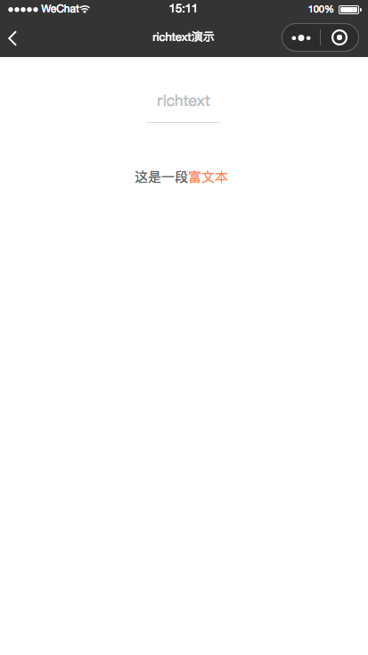
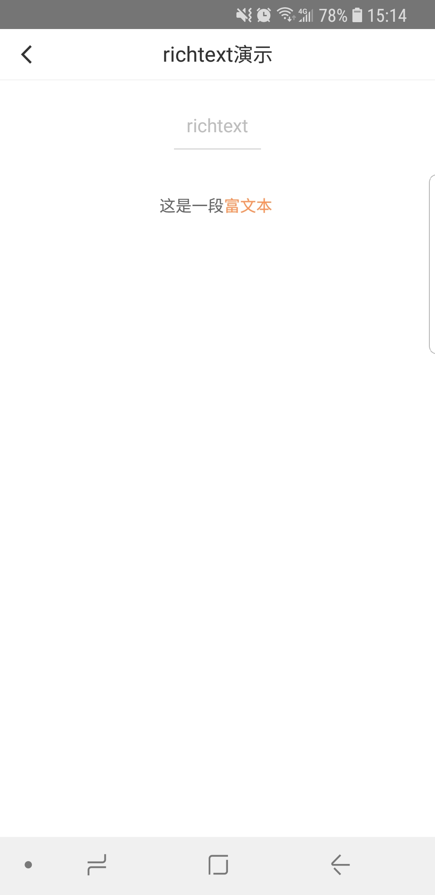

# richtext
-------
`<richtext>`是用于富文本格式数据转换的基础内容组件。

## 属性

<table>
  <tr>
    <th width="200px">属性名</th>
    <th>类型</th>
    <th width="60px">必填</th>
    <th>说明</th>
  </tr>
  <tr>
    <td>richData</td>
    <td>Object</td>
    <td>是</td>
    <td>富文本数据，格式为：{message, rich_message}</td>
  </tr>
</table>

#### richData.message
<table>
  <tr>
    <th width="200px">属性名</th>
    <th>类型</th>
    <th width="60px">必填</th>
    <th>说明</th>
  </tr>
  <tr>
    <td>message</td>
    <td>String</td>
    <td>是</td>
    <td>文本内容</td>
  </tr>
</table>

#### richData.rich_message
<table>
  <tr>
    <th width="200px">属性名</th>
    <th>类型</th>
    <th width="60px">必填</th>
    <th>说明</th>
  </tr>
  <tr>
    <td>rich_message</td>
    <td>Array</td>
    <td>是</td>
    <td>富文本处理信息，rich_message[index]为对象</td>
  </tr>
</table>

#### rich_message[index]
<table>
  <tr>
    <th width="200px">属性名</th>
    <th>类型</th>
    <th width="60px">必填</th>
    <th>说明</th>
  </tr>
  <tr>
    <td>start</td>
    <td>Number</td>
    <td>是</td>
    <td>属性覆盖起始下标（0开始）</td>
  </tr>
  <tr>
    <td>end</td>
    <td>Number</td>
    <td>是</td>
    <td>属性覆盖结束下标</td>
  </tr>
  <tr>
    <td>color</td>
    <td>String</td>
    <td>是</td>
    <td>字体颜色</td>
  </tr>
  <tr>
    <td>font_size</td>
    <td>Number</td>
    <td>是</td>
    <td>字体大小，单位为cpx</td>
  </tr>
  <tr>
    <td>font_family</td>
    <td>String</td>
    <td>否</td>
    <td>字体名称，可选系统支持名称，否则降级为系统默认字体</td>
  </tr>
  <tr>
    <td>font_style</td>
    <td>String</td>
    <td>否</td>
    <td>字体样式，可选 italic | normal，默认 normal</td>
  </tr>
  <tr>
    <td>font_weight</td>
    <td>String</td>
    <td>否</td>
    <td>文本粗细，可选 bold | normal，默认 normal</td>
  </tr>
  <tr>
    <td>text_decoration</td>
    <td>String</td>
    <td>否</td>
    <td>文本修饰，可选 underline | line-through | none，默认 none</td>
  </tr>
  <tr>
    <td>click</td>
    <td>Boolean</td>
    <td>否</td>
    <td>是否增加事件监听，可选 true | false ，默认 false</td>
  </tr>
  <tr>
    <td>callback</td>
    <td>Function</td>
    <td>否</td>
    <td>事件监听回调，建议使用箭头函数</td>
  </tr>
  
</table>


## 示例
```html
<template>
<view class="container">
  <richtext rich-data="{{richData}}"></richtext>
</view>
</template>
<script>
import cml from 'chameleon-api';
class Richtext {
  data = {
    richData: {
      message: '这是一段富文本',
      rich_message: [
        {
          "color": "#666666",
          "font_size": 28,
          "start": 0,
          "end": 3,
          "font_family": "sans",
          "font_weight": "normal",
          "click": false
        },
        {
          "color": "#fc9153",
          "font_size": 28,
          "start": 4,
          "end": 6,
          "font_family": "serif",
          "font_weight": "bold",
          "font_style": "normal",
          "text_decoration": "underline",
          "click": true,
          "callback": () => {
            this.methods.clickHandle()
          }
        }
      ]
    }
  }
  methods = {
    clickHandle() {
      cml.showToast({
        message: 'richtext click'
      })
    }
  }
}

export default new Richtext();
</script>
<style scoped>
.container {
  display: flex;
  flex-direction: column;
  align-items: center;
}
</style>
<script cml-type="json">
{
  "base": {}
}
</script>
```
<div style="display: flex;flex-direction: row;justify-content: space-around; align-items: flex-end;">
  <div style="display: flex;flex-direction: column;align-items: center;">
    
    <text style="color: #fda775;font-size: 24px;">wx</text>
  </div>
  <div style="display: flex;flex-direction: column;align-items: center;">
    
    <text style="color: #fda775;font-size: 24px;">web</text>
  </div>
  <div style="display: flex;flex-direction: column;align-items: center;">
    
    <text style="color: #fda775;font-size: 24px;">native</text>
  </div>
</div>

## 注意
richtext为chameleon-sdk扩展组件，在weex-playground中不会渲染，请用chameleon-playground扫描查看渲染结果。