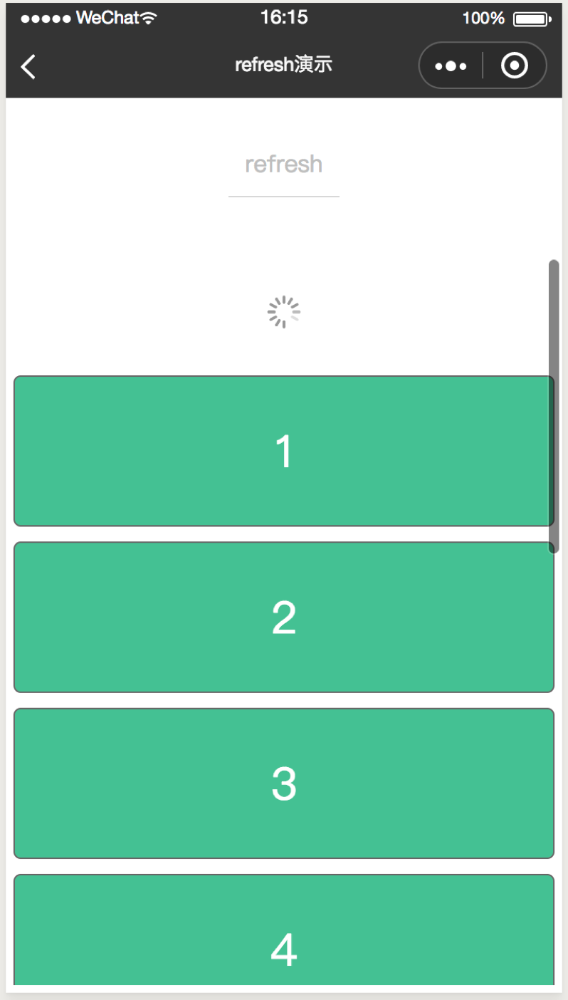
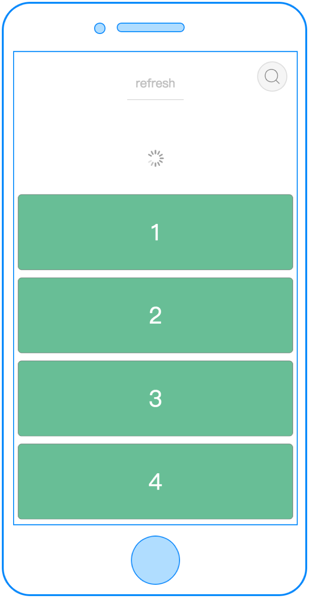
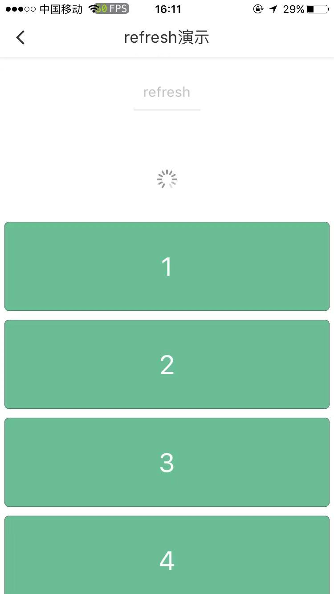

# c-refresh

---

上拉&下拉刷新

###属性

<table>
  <tr>
    <th>属性名</th>
    <th>类型</th>
    <th>必填</th>
    <th>默认值</th>
    <th>说明</th>
  </tr>
  <tr>
    <td>display</td>
    <td>Boolean</td>
    <td>否</td>
    <td>false</td>
    <td>是否显示上拉&下拉</td>
  </tr>
  <tr>
    <td>direction</td>
    <td>String</td>
    <td>否</td>
    <td>top</td>
    <td>上拉或者下拉，top表示下拉刷新，bottom表示上拉刷新</td>
  </tr>
  <tr>
    <td>custom-ui</td>
    <td>Boolean</td>
    <td>否</td>
    <td>false</td>
    <td>是否要自定义ui, 选择自定义ui需要可在c-refresh标签内部布局和定义</td>
  </tr>
  <tr>
    <td>c-bind:refreshevent</td>
    <td>EventHandle</td>
    <td>是</td>
    <td></td>
    <td>
    下拉或上拉时出发:
    <br/>
    返回事件对象:
    <br/>event.detail
    <br/>返回值：
    <br/>event.detail.value
  </tr>
</table>

###示例

```html
<template>
<page title="refresh演示">
  <view class="container">
    <scroller
      scroll-direction="{{scrollDirection}}"
      bottom-offset="{{bottomOffset}}"
      c-bind:scrolltobottom="onBottom"
      c-bind:onscroll="onScroll"
      height="{{-1}}"
    >
      <c-refresh
        display="{{ topRefreshing }}"
        c-bind:refreshevent="onrefreshUp"
        >
      </c-refresh>
      <view
          class="cell"
          c-for="{{panels}}"
          c-for-index="i"
          c-for-item="item"
          c-bind:tap="change"
          data-idx="{{i}}"
      >
          <view class="panel" style="{{item.computedStyle}}">
              <text class="text">{{item.label}}</text>
          </view>
      </view>
      <view class="no-more-text" c-if="{{ page >= sumPage }}"><text>没有更多了...</text></view>
      <c-refresh c-else
        display="{{ bottomRefreshing }}"
        direction="bottom"
        custom-ui="{{ true }}"
        c-bind:refreshevent="onrefreshDown"
        >
        <view class="loading-text" style="{{ loadingTextStyle }}"><text>上拉刷新...</text></view>
      </c-refresh>
    </scroller>
  </view>
</page>
</template>
<script>
import cml from 'chameleon-api'

class Refresh {
  data = {
    topRefreshing:false,
    bottomRefreshing: false,
    bottomOffset: 20,
    scrollDirection: 'vertical',
    panels: [
    ],
    rows: [],
    sumPage: 4,
    page: 0,
    loadingTextStyle: ''
  }

  methods = {
    getPanels (direction) {
      if (this.page >= this.sumPage) return
      let rows = this.randomfn()
      this.panels = direction == 1 ? [...this.panels, ...rows]: [...rows, ...this.panels];
      this.page++;
    },
    onrefreshUp (e) {
      this.topRefreshing = e.detail.value
      setTimeout(() => {
        this.getPanels(-1)
        this.topRefreshing = false
      }, 2000)
    },
    onrefreshDown (e) {
      this.bottomRefreshing = e.detail.value
      setTimeout(() => {
        this.getPanels(1)
        this.bottomRefreshing = false
      }, 2000)
    },
    change (e) {
        let target = e.currentTarget
        let dataset = target.dataset
        let i = dataset.idx

        const item = this.panels[i]
        if (item) {
            item.height = item.height === 200 ? 400 : 200
            item.width = item.width === 330 ? 730 : 330
            item.computedStyle = `height:${item.height}cpx;width:${item.width}cpx;background-color:${item.bgc};opacity:${item.opacity}`
        }
    },
    randomfn () {
        let ary = [];
        for(let i = 1; i<= 10; i++) {
            let item = {label: this.page * 10 + i ,height: 200 , width:730, bgc:'#69BE96',opacity:1}
            item.computedStyle = `height:${item.height}cpx;width:${item.width}cpx;background-color:${item.bgc};opacity:${item.opacity}`

            ary.push(item)
        }
        return ary;
    },
    onScroll(e) {
      let scrollTop = e.detail.scrollTop;
      if (scrollTop <= 0) {
        this.topRefreshing = true;
      }
    },
    onBottom(e) {
      if (this.bottomRefreshing || this.page >= this.sumPage) return
      this.bottomRefreshing = true;
    }
  }

  created(res) {
    this.getPanels()
    this.loadingTextStyle = 'color:#999;font-size:36cpx;margin:30cpx 0;'
  }

}

export default new Refresh();
</script>
<style scoped>
.container {
  flex: 1;
}
.title {
  text-align: center;
  flex-direction: row;
  justify-content: center;
}
.panel {
    display: flex;
    margin: 10cpx;
    top:10cpx;
    align-items: center;
    justify-content: center;
    text-align: center;
    border: 1px solid #666;
    border-radius: 10cpx;
    transition-property: width,height;
    transition-duration: 0.5s;
    transition-delay: 0s;
    transition-timing-function: cubic-bezier(0.25, 0.1, 0.25, 1.0);
}
.cell{
    display: flex;
    background-color:white;
    flex-direction: row;
}

.text {
    font-size: 60cpx;
    color: white;
}
.no-more-text {
  color: #999;
  font-size: 36cpx;
  text-align: center;
  margin:50cpx 0;
  display: flex;
  justify-content: center;
  flex-direction: row;
  align-items: center;
}
</style>
<script cml-type="json">
{
    "base": {
        "usingComponents": {
          "c-refresh": "cml-ui/components/c-refresh/c-refresh"
        }
    },
    "wx": {}
}
</script>
```

<div style="display: flex;flex-direction: row;justify-content: space-around; align-items: flex-end;">
  <div style="display: flex;flex-direction: column;align-items: center;">
    
    <text style="color: #fda775;font-size: 24px;">wx</text>
  </div>
  <div style="display: flex;flex-direction: column;align-items: center;">
    
    <text style="color: #fda775;font-size: 24px;">web</text>
  </div>
  <div style="display: flex;flex-direction: column;align-items: center;">
    
    <text style="color: #fda775;font-size: 24px;">native</text>
  </div>
</div>

### Bug & Tip
1. `<c-refresh>` 组件必须定义在`<scroller>`或`<list>`组件内部, 并且在垂直方向上才能生效。
2. `<c-refresh>` 组件使用时建议将`<scroller>`或`<list>`组件进行fixed的定位，否则下拉效果失效。
