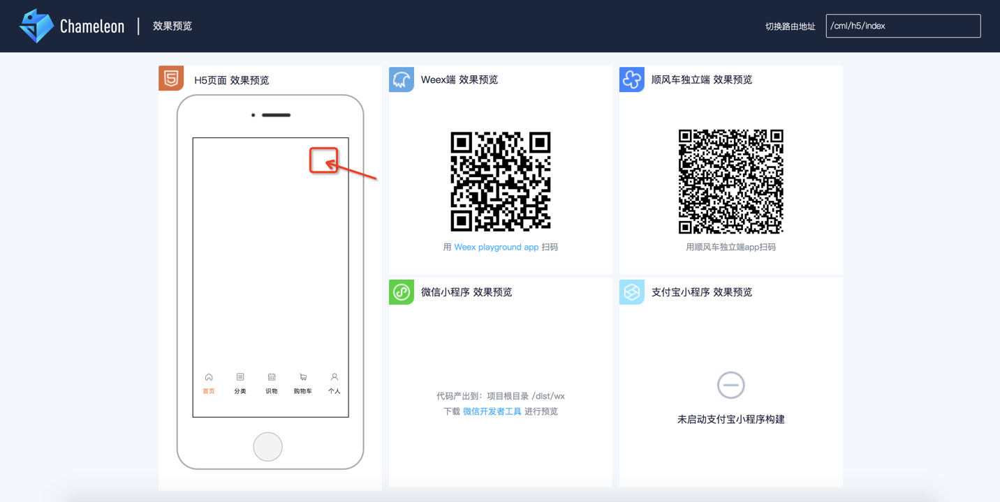
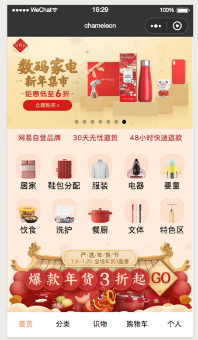
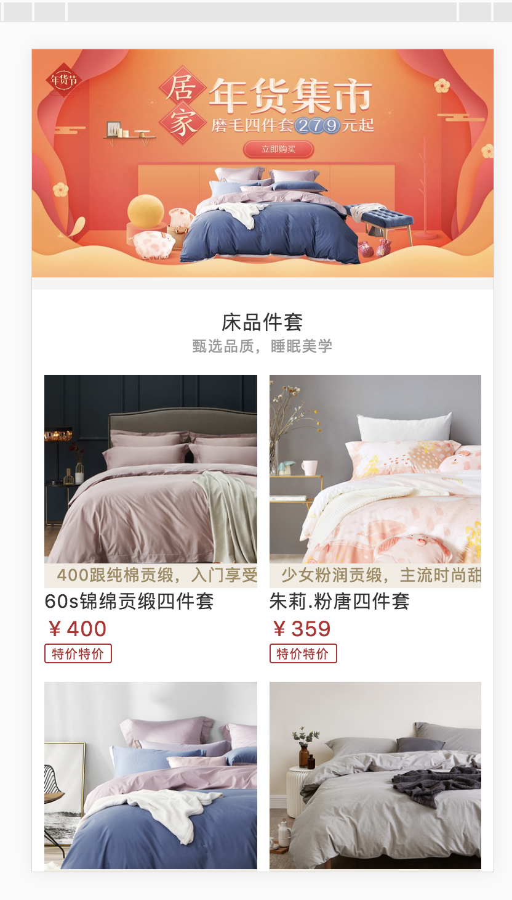
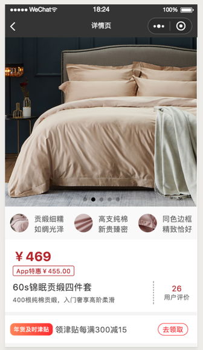
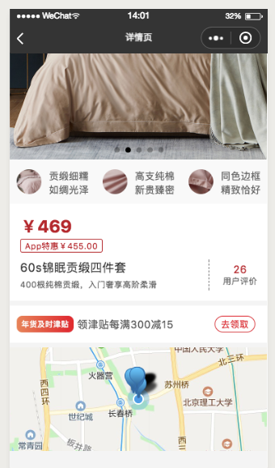
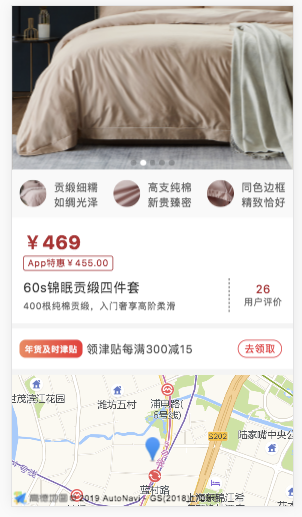
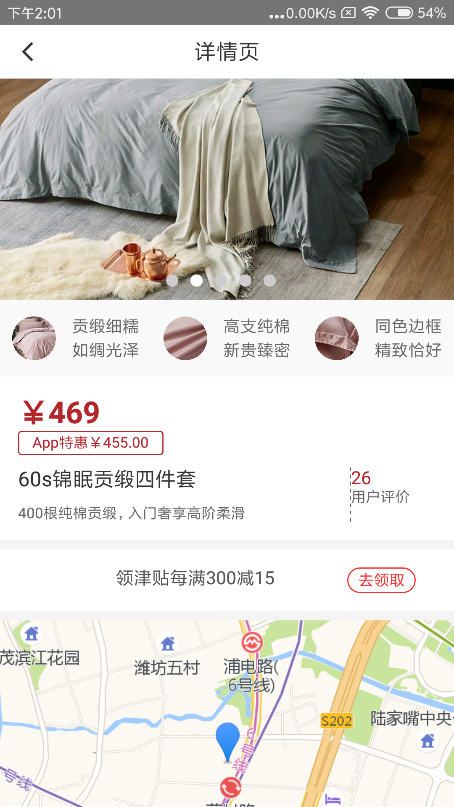

# 手把手教你系列- 实现复杂应用

## 背景介绍
 今天我们使用`cml`开发一个复杂跨端应用————仿网易严选app，实现一套代码运行在web、小程序和Native的目标。
 借此项目，讲解日常开发中会遇到的问题&tip，包括不限于：
 
 - [路由](#router)
 - [状态管理](#store)
 - [页面跳转](#tiaozhuan)
 - [ajax请求](#ajax)
 - [mock数据](#mock)
 - [组件扩展](#kuozhan)
 - [多态](#duotai)
 - [组件配置](../framework/json.md)
及组件设计等等，以及多端的差异化需求。
   

<a href="../extend/new-wangyi.zip" target="_blank">项目码源</a>

### 1 准备工作

- 参照【[快速上手](../quick_start/quick_start.md)】进行`chameleon-tool`全局环境配置；
- `cml init project`初始化一个项目，命名`wangyi `;

### 2 构建首页
<span style="color:#B4282D;">分析</span>：首先我们把首页分为`content`和`footer`两部分，`content`作为主要的内容区域，
`footer`作为底部。其次，
利用`Chameleon`的API方法[c-animate](../api/createAnimation/createAnimation.md)来实现内容`content`切换；
然后，利用扩展组件[c-tab](../component/expand/compound/c-tab.md)来实现`tab`切换功能；


#### 2.1 构建首页--footer

<span style="color:#B4282D;">分析</span>：因为`footer`的东西相对较少，因此把它放在前面来做；
首先把`tab`切换的配置数据放在[store](../logic/store.md)里面，配合[c-tab](../component/expand/compound/c-tab.md)
来实现tab切换功能；

- 改造`store/state.js`文件如下：

```javascript
const state = {
  tabs: [
    {label: '首页'},
    {label: "分类"},
    {label: '识物'},
    {label: '购物车'},
    {label: '个人1'}
  ]
}
export default state
```

- `cml init project`初始化一个`home`组件，用来放置首页的子组件；
<span style="color:#B4282D;">注意：</span>也可以创建一个`common`组件，存放公共组件。
- 在`src/component/home`文件夹下新建`tab.cml`,
在`created`里面请求<span id="store" style="color: #B4282D;">store</span>里面的数据,
改造`tab.cml`代码如下；

```javascript
<template>
  <view class="tab">
    <c-tab tabs="{{tabs}}"
      c-bind:tabclick="handleTabTap"
      active-label="{{activeLabel}}"
      inline="{{false}}"
      has-underline="{{false}}"
    >
    </c-tab>
  </view>
</template>
<script>
import store from '../../store'
class Index {
  data = {
    animationData: {},
    tabs:[],
    activeLabel: '首页',
  }
  methods = {
    handleTabTap(e) {
      const oIndex = e.detail.activeIndex;
      this.activeLabel = e.detail.label;
      this.$cmlEmit('translate', { oIndex });
    }
  }
  created (){
    this.tabs = store.state.tabs;
  }
}

export default new Index();
</script>
<script cml-type="json">
{
  "base": {
    "usingComponents": {
        "c-tab": "cml-ui/components/c-tab/c-tab"
    }
  }
}
</script>

```

- 将自定义组件`tab`引入到首页，修改`page/index/index.cml`文件配置；

```javascript
<script cml-type="json">
{
  "base": {
    "usingComponents": {
      "tab": "/components/home/tab"
    }
  },
  ...
}
</script>

```

刷新页面如图，鼠标滑至图中箭头指向位置，点击打开web端调试。



#### 2.2 构建首页--content
<span style="color:#B4282D;">分析</span>：
- 为了多端的一致性，我们设计了内置组件[scroller](../component/base/layout/scroller.md)来处理页面的滚动；
- 把首页的`content`区域分为顶部轮播、服务类型、商品分类以及特色服务四个模块。
- 顶部轮播用内置组件[carousel](../component/base/layout/carousel.md)来实现；
- 商品分类用`CML-标准语法`的[列表渲染](../view/iterator.md)来实现；
- 服务类型和特色服务用`CMSS`的[flex](../view/cmss/layout.md)标准来实现定制化需求；
- 使用`chameleon`的[数据mock](../framework/mock.md)来实现本地mock数据的ajax请求；

#####  content实现
- <span id="mock" style="color: #B4282D;">mock数据</span>：配置一个`api/getHomeImgList`接口，返回首页数据；
更改`mock/api/index.js`文件，代码如下：

```javascript

{
  method: ['get', 'post'],
  path: '/api/getHomeImgList',
  controller: function (req, res, next) {
    res.json({
      code: 0,
      data: { 
        bannerImgList: [
          { imgUrl: 'https://yanxuan.nosdn.127.net/973e299ac2e80c03acfb5d2d4501231c.jpg?imageView&quality=75&thumbnail=750x0'}
          ...  // 详情见码源
        ],
        ...
      }
    });
  }
}

```

- 在`src/component/home`文件下分别新建`lunbo.cml`、`service.cml`、`classlist.cml`、`special.cml`四个组件；
- 在`chameleon`的生命周期钩子函数里面去<span id="ajax" style="color: #B4282D;">请求ajax</span>，`lunbo.cml`代码如下：

```javascript
<template>
  <view class="carousel">
    <carousel class="carousel-container" indicator-dots="{{true}}"  current="{{1}}" circular="{{true}}" autoplay="{{true}}">
      <carousel-item
        class="carousel-carousel-item"
        c-for="{{bannerImgList}}"
        c-for-index="i"
        c-for-item="item"
        data-idx="{{i}}"
      >
        <image src="{{item.imgUrl}}" class="Img"/>
      </carousel-item>
    </carousel>
  </view>
</template>

<script>
  import cml from 'chameleon-api';
  class Carousel {
    data = {
      bannerImgList: []
    }
    created() {
      cml.get({
        url: '/api/getHomeImgList'
      }).then(res => {
        if (res.code == 0) {
          const {bannerImgList} = res.data;
          this.bannerImgList = bannerImgList;
        }
      })
    }
  }
  export default new Carousel()
  
</script>

```

- `service.cml`文件代码如下：

```javascript
<template>
  <view class="service">
    <text class="service-item">网易自营品牌</text>
    <text class="service-item">30天无忧退货</text>
    <text class="service-item">48小时快速退款</text>
  </view>
</template>
```

- `classlist.cml`文件代码如下：

```javascript
<template>
  <view class="classList">
    <view
      class="classList-item"
      c-for="{{classifyImgList}}"
      c-for-index="i"
      c-for-item="item"
      c-bind:tap="change"
      data-idx="{{i}}"
    >
      <image src="{{item.imgUrl}}" style="width: 110cpx;height:110cpx;" class="classList-item-img"></image>
      <view class="classList-item-title">
        <text>{{item.title}}</text>
      </view>
    </view>
  </view>
</template>
<script>
  import cml from "chameleon-api";
  class Classlist {
    data = {
      classifyImgList: []
    }
    methods = {
      change() {
        console.log('chameleon')
      }
    }
    created() {
      cml.get({
        url: '/api/getHomeImgList'
      }).then(res => {
        if (res.code == 0) {
          const {classifyImgList} = res.data;
          this.classifyImgList = classifyImgList;
        }
      })
    }
  }
  export default new Classlist();
</script>


```

- `special.cml`文件代码如下：

```javascript
<template>
  <view class="special" c-bind:tap="test">
    <view class="special-door">
      <image src="{{disscountPriceImgUrl}}" class="special-door-img"></image>
    </view>
    <view class="special-info">
      <view class="special-info-left">
        <image src="{{special.newPerson}}" class="special-info-left-img"></image>
      </view>

      <view class="special-info-right">
        <image src="{{special.temai}}" class="special-info-right-top"></image>
        <image src="{{special.qingdan}}" class="special-info-right-bottom"></image>
      </view>
    </view>
  </view>
</template>

<script>
  import cml from 'chameleon-api';
class Special {
  data = {
    special: '',
    disscountPriceImgUrl: ''
  }
  methods = {
    test(){
      cml.navigateTo({
         "path": "/pages/list/list"
      })
    }
  }
  created() {
    cml.get({
      url: '/api/getHomeImgList'
    }).then(res => {
      if(res.code == 0){
        const { special, disscountPriceImgUrl } = res.data;
        this.special = special;
        this.disscountPriceImgUrl = disscountPriceImgUrl;
      }
    })
  }
}
export default new Special();
</script>

```

- 把`content`子组件引入首页中；更改`pages/index.cml`配置：

```javascript
<script cml-type="json">
  {
    "base": {
      "usingComponents": {
        "ctab": "/components/home/tab",
        "ccarousel": "/components/home/lunbo",
        "service": "/components/home/service",
        "classlist": "/components/home/classlist",
        "special": "/components/home/special"
      }
    }
  }
</script>
```

刷新页面如图：



### 3 构建列表页
<span style="color:#B4282D;">分析</span>：首先最外层要包裹一个`scroller`组件，上拉刷新下来加载这个功能用
<span id="kuozhan" style="color: #B4282D;">扩展组件</span>：[c-refresh](../component/expand/polymorphism/c-refresh.md)
来实现；然后用`CML-标准语法`的[列表渲染](../view/iterator.md)填充列表；
由于是一个新建页面，因此需要[配置路由](../framework/router.md)以及页面的[跳转](../api/navigate.md)；最后是列表页的[mock数据](../framework/mock.md)；
由于构建首页已经介绍了组件的使用方式，故此页面不再分拆子组件；


- 执行`cml init page`初始化生成`list`页面;

- 配置`list`页面<span id="router" style="color: #B4282D;">路由</span>，我们更改`src/router.config.json`文件，具体如下：

```javascript
{
  "mode": "history",
  "domain": "https://www.chameleon.com",
  "routes":[
    ...
    {
      "url": "/cml/h5/list",
      "path": "/pages/list/list",
      "name": "列表页面",
      "mock": "index.php"
    }
  ]
}
```

- 如何从首页<span id="tiaozhuan" style="color: #B4282D;">跳转</span>到列表页呢？我们更改组件`classlist.cml`中的`methods`中的change方法：

```javascript
methods = {
  change() {
    cml.navigateTo({
      "path": "/pages/list/list"
    });
  }
}
```

- 配置`list`页面的<span id="mock" style="color: #B4282D;">mock数据</span>：
配置`/api/listImage`接口，更改`mock/api/index.js`文件，具体如下：

```javascript
...
{
    method: ['get', 'post'],
    path: '/api/listImage',
    controller: function (req, res, next) {
      res.json({
        code: 0,
        data: {
          topImgUrl: 'http://yanxuan.nosdn.127.net/4972949f269e7295a4f37e99a303553e.jpg?quality=85&thumbnail=750x0&imageView',
          list: [
            {
              imgUrl: 'http://yanxuan.nosdn.127.net/8635c42f2b3a92768b12015c491821b5.png?imageView&quality=65&thumbnail=330x330',
              des: '400跟纯棉贡缎，入门享受奢华感受',
              name: '60s锦绵贡缎四件套',
              money: '￥400',
              tag: ['APP特惠']
            },
            ...
          ]
        }
      });
    }
}

```

- 改造`pages/list/list.cml`文件中的代码；

```javascript
<template>
  <page title="列表">
    <view class="container">
      <scroller
        scroll-direction="{{scrollDirection}}"
        bottom-offset="{{bottomOffset}}"
        c-bind:scrolltobottom="onBottom"
        c-bind:onscroll="onScroll"
        height="{{-1}}"
      >
        <c-refresh display="{{ topRefreshing }}" c-bind:refreshevent="onrefreshUp"></c-refresh>
        <view>
          <view class="bannerImg">
            <image src="{{topImg}}" class="topImg"/>
          </view>
          <view class="scrollContent">
            <view class="scrollContent__title">
              <text class="scrollContent__title__con">床品件套</text>
            </view>
            <view class="scrollContent__des">
              <text class="scrollContent__des__con">甄选品质，睡眠美学</text>
            </view>
            <view class="scrollContent__list">
              <view
                class="scrollContent__list__item"
                c-for="{{list}}"
                c-for-index="i"
                c-for-item="item"
                c-bind:tap="change"
                data-idx="{{i}}"
              >
                <view class="scrollContent__list__item-content">
                  <image src="{{item.imgUrl}}" class="scrollContent__list__item-content-img"/>
                  <view class="scrollContent__list__item-content-des">{{item.des}}</view>
                </view>
                <text class="scrollContent__list__item-name">{{item.name}}</text>
                <text class="scrollContent__list__item-money">{{item.money}}</text>
                <text class="scrollContent__list__item-tag">App特工</text>
              </view>
            </view>
          </view>
        </view>
        <view class="no-more-text" c-if="{{ page >= sumPage }}">
          <text>没有更多了...</text>
        </view>
        <c-refresh c-else
           display="{{ bottomRefreshing }}"
           direction="bottom"
           custom-ui="{{ true }}"
           c-bind:refreshevent="onrefreshDown"
        >
          <view class="loading-text" style="{{ loadingTextStyle }}">
            <text>上拉刷新...</text>
          </view>
        </c-refresh>
      </scroller>
    </view>
  </page>
</template>
<script>
  import cml from 'chameleon-api'

  class Refresh {
    data = {
      topRefreshing: false,
      bottomRefreshing: false,
      bottomOffset: 20,
      scrollDirection: 'vertical',
      loadingTextStyle: '',
      list: [],
      topImg: ''
    }
    methods = {
      onrefreshUp(e) {
        this.topRefreshing = e.detail.value
        setTimeout(() => {
          this.topRefreshing = false
        }, 500)
      },
      onrefreshDown(e) {
        this.bottomRefreshing = e.detail.value
        setTimeout(() => {
          this.getData();
          this.bottomRefreshing = false
        }, 2000)
      },
      change(e) {
        console.log('click');
      },

      onScroll(e) {
        let scrollTop = e.detail.scrollTop;
        if (scrollTop <= 0) {
          this.topRefreshing = true;
        }
      },
      onBottom(e) {
        if (this.bottomRefreshing || this.page >= this.sumPage) return
        this.bottomRefreshing = true;
      },
      getData() {
        cml.get({
          url: '/api/listImage'
        }).then(res => {
          if (res.code == 0) {
            const {topImgUrl, list} = res.data;
            this.list = [...this.list, ...list];
            this.topImg = topImgUrl;
          }
        })
      }
    }

    created(res) {
      this.loadingTextStyle = 'color:#666;font-size:36cpx;margin:30cpx auto;';
      this.getData();
    }
  }

  export default new Refresh();
</script>

<script cml-type="json">
{
  "base": {
    "usingComponents": {
      "c-refresh": "@didi/chameleon-ui/components/c-refresh/c-refresh"
    }
  }
}
</script>

```

可以上拉刷新，下拉加载，如图：


### 4 构建详情页
<span style="color:#B4282D;">分析</span>：详情页仍然需要在顶层包裹一个`scroller`组件；
增加一个地图组件，用[组件多态](../framework/polymorphism/component.md)来实现它；
此页面不再分拆子组件；


- 按照构建列表页的方式新建一个`detail`页面，并在`src/router.config.json`文件中配置路由；

- 在`pages/list.cml`文件中配置跳转链接；

```javascript
methods = {
    change(e) {
        cml.navigateTo({
            "path": "/pages/home/home",
            query: {
                a: 1,
                b: 'test'
            }
        })
    }
}
```

- 配置`detail`页面的mock数据，修改`mock/api/index.js`文件，增加一个`api/detailInfo`接口，如下：

```javascript
{
  method: ['get', 'post'],
  path: '/api/detailInfo',
  controller: function (req, res, next) {
    res.json({
      code: 0,
      data: {
        carouselList: [
          { imgUrl: 'http://yanxuan.nosdn.127.net/5240f52c0f410054fe9c20abc54aa7b9.jpg?imageView&quality=75&thumbnail=750x0'},
          ...
        ],
        description: [
          {
            imgUrl: 'http://yanxuan.nosdn.127.net/17e5327561f5b9df04f7d000a8c71bb2.jpg',
            tag1: '贡缎细糯',
            tag2: '如绸光泽'
          }
          ...
        ],
        money: '￥469',
        tag: 'App特惠￥455.00'
      }
    });
  }
}

```

- 改造`detail`页面代码如下，样式详情请见源码：

```javascript
<template>
  <page title="详情页">
    <view class="content">
      <scroller
        scroll-direction="vertical"
        bottom-offset="{{20}}"
        height="{{-1}}"
      >
        <view class="carousel">
          <carousel class="carousel-container" indicator-dots="{{true}}" current="{{1}}" circular="{{true}}">

            <carousel-item
              class="carousel-carousel-item"
              c-for="{{bannerImg}}"
              c-for-index="i"
              c-for-item="item"
              c-bind:tap="change"
              data-idx="{{i}}"
            >
              <image src="{{item.imgUrl}}" class="Img"/>
            </carousel-item>

          </carousel>
        </view>

        <view class="description">
          <view
            class="description-item"
            c-for="{{descriptionInfo}}"
            c-for-index="i"
            c-for-item="item"
            c-bind:tap="change"
            data-idx="{{i}}"
          >
            <view class="description-item-img">
              <image src="{{item.imgUrl}}" class="description-item-img-con"/>
            </view>
            <view class="description-item-des">
              <text class="description-item-des-tag">{{item.tag1}}</text>
              <text class="description-item-des-tag">{{item.tag2}}</text>
            </view>
          </view>
        </view>

        <view class="section">

          <view class="section-money">
            <text class="class-money">{{money}}</text>
          </view>

          <view class="section-tag" c-bind:tap="tiaozhuan">
            <text class="section-tag-con">{{appTag}}</text>
          </view>

          <view class="section-evaluate">
            <view class="section-evaluate-info">
              <text class="section-evaluate-info-name">60s锦眠贡缎四件套</text>
              <text class="section-evaluate-info-desc">400根纯棉贡缎，入门奢享高阶柔滑</text>
            </view>
            <view class="section-evaluate-number">
              <text class="section-evaluate-number-total">26</text>
              <text class="section-evaluate-number-ping">用户评价</text>
            </view>
          </view>
        </view>

        <view class="coupon">
          <text class="coupon-tag">年货及时津贴</text>
          <text class="coupon-money">领津贴每满300减15</text>
          <text class="coupon-get">去领取</text>
        </view>

      </scroller>
    </view>
  </page>
</template>

<script>
  import cml from 'chameleon-api'

  class Detail {

    data = {
      chameleonSrc: require('../../assets/images/chameleon.png'),
      bannerImg: [],
      descriptionInfo: [],
      money: 0,
      appTag: ''
    }

    methods = {
      tiaozhuan() {
        cml.open(
          'https://www.baidu.com',
          {
            wd: 'didichuxing',
            time: new Date()
          },{
            closeCurrent: false
          });
      }
    }

    created() {

      cml.get({
        url: '/api/detailInfo'
      }).then(res => {
        if (res.code == 0) {
          const {carouselList, description, money, tag} = res.data;
          this.bannerImg = carouselList;
          this.descriptionInfo = description;
          this.money = money;
          this.appTag = tag;
        }
      })
    }
  }
  export default new Detail();
</script>

```

- 刷新页面如图：

#### 4.1 用<span id="duotai" style="color: #B4282D;">多态</span>组件实现地图功能；

##### 1 初始化一个多态组件；

- 终端输入：`cml init component`，选择多态组件，输入组件名`map`，回车。

- 在`src/component`下面，可以看到四个文件：`map.interface`、`map.web.cml`、`map.weex.cml`和`map.wx.cml`;

##### 2 多态组件---web组件(map.web.cml)改造；

- 选择高德地图，并且用`vue-amap`这个库；执行`npm i vue-amap --save`；
- 进行基本的改造之后，`map.web.cml`文件代码如下：

```javascript
<template>
  <view>
    <view class="amap-wrapper">
      <el-amap vid="amapDemo" :zoom="zoom" :center="center" class="amap-box">
        <el-amap-marker vid="component-marker" :position="componentMarker.position"></el-amap-marker>
      </el-amap>
    </view>
  </view>
</template>
<script>
  import VueAMap from 'vue-amap';
  VueAMap.initAMapApiLoader({
    key: '秘钥',  //  高德web秘钥
    plugin: ['AMap.Scale', 'AMap.OverView', 'AMap.ToolBar', 'AMap.MapType'],
    uiVersion: '1.0',
    v: '1.4.4'
  });
  class Map implements MapInterface {
    data = {
      zoom: 14,
      center: [121.5273285, 31.21515044],
      componentMarker: {
        position: [121.5273285, 31.21315058]
      }
    }
    mounted() {
      this.$cmlEmit('onshow',{
        value: this.name
      })
    }
  }
  export default new Map();
</script>

```

- 在`pages/detail/detail.cml`文件中，我们引入`map`组件组件。配置如下：

```javascript
<template>
  <page title="详情页">
      <view class="content">
        <scroller
          scroll-direction="vertical"
          bottom-offset="{{20}}"
          height="{{-1}}"
        >
          ...  
          <view class="coupon"></view>
          <view class="map">
            <map></map>
          </view>
        </scroller>
      </view>
  </page>
</template>

<script cml-type="json">
{
  "base": {
    "usingComponents": {
        "map": "/components/map/map"
    }
  }
}
</script>

```

- 刷新页面，可以看到web端正常显示出来了地图；其他端显示的是默认值；


##### 3 多态组件---微信小程序组件(map.wx.cml)改造；
- 根据高德地图小程序开发文档，下载`amap-wx.js`的SDK文件，暂时放到`map`组件里面。
- 改造`map.wx.cml`文件；具体代码如下：

```javascript
<template>
  <view class="map_container">
    <origin-map class="map" id="map" longitude="{{longitude}}" latitude="{{latitude}}" scale="14" show-location="true"
      markers="{{markers}}" bindmarkertap="makertap"></origin-map>
  </view>
</template>

<script>
  import cml from 'chameleon-api';
  import amapFile from './amap-wx';
  var markersData = [];
  class Map implements MapInterface {
    data = {
      markers: [],
      latitude: '',
      longitude: '',
      textData: {}
    };
    methods = {
      makertap: function (e) {
        var id = e.markerId;
        var that = this;
        that.showMarkerInfo(markersData, id);
        that.changeMarkerColor(markersData, id);
      },
      showMarkerInfo: function (data, i) {
        this.textData = {
          name: data[i].name,
          desc: data[i].address
        }
      },
      changeMarkerColor: function (data, i) {
        var that = this;
        var markers = [];
        this.markers = markers;
      }
    }
    mounted() {
      var me = this;
      this.$cmlEmit('onshow', {
        value: this.name
      })
      var myAmapFun = new amapFile.AMapWX({key: '高德地图小程序开发秘钥'});
      myAmapFun.getPoiAround({
        success: function (data) {
          markersData = data.markers;
          me.markers = markersData;
          me.latitude = markersData[0].latitude;
          me.longitude = markersData[0].longitude;
          me.showMarkerInfo(markersData, 0);
        },
        fail: function (info) {
          cml.showToast({message: JSON.stringify(info.errMsg)});
        }
      })
    }
  }

  export default new Map();
</script>

```
- 刷新页面，小程序端和web端正常显示出来了地图；native端显示的是默认值；

##### 4 多态组件---native端(map.weex.cml)改造；

- 初始化一个`map`页面：输入`cml init page`,输入`map`；
- 给新页面`map.cml`配置路由，改造`src/router.config.json`文件；

```javascript
{
  "mode": "history",
  "domain": "https://www.chameleon.com",
  "routes":[
    ...
    {
      "url": "/cml/h5/map",
      "path": "/pages/map/map",
      "name": "地图",
      "mock": "index.php"
    }
  ]
}

```

- 在页面`map.cml`文件中引入多态组件；具体代码如下：

```javascript
<template>
  <view>
    <map></map>
  </view>
</template>
<script>
class Map {}
export default new Map();
</script>
<script cml-type="json">
{
  "base": {
    "usingComponents": {
      "map": "/components/map/map"
    }
  }
  ...
}
</script>

```
- 我们在web端访问本地地址：`http://172.22.138.75:8000/cml/h5/map`，正常显示出来地图；
- 接下来，我们改造`map.weex.cml`文件；具体代码如下：

```javascript

<template>
  <view class="map-container">
    <origin-web ref="webview" style="width: 750px; height: 350px" :src="h5url"></origin-web>
  </view>
</template>

<script>
  class Map implements MapInterface {
    data= {
      h5url: "http://172.22.138.75:8000/cml/h5/map"
    }
    mounted() {
      this.$cmlEmit('onshow',{
        value: this.name
      })
    }
  }
  export default new Map();
</script>

```

各端的显示如图：

<div style="display: flex;flex-direction: row;justify-content: space-around; align-items: flex-end;">
  <div style="display: flex;flex-direction: column;align-items: center;">
    
    <text style="color: #fda775;font-size: 24px;">wx</text>
  </div>
  <div style="display: flex;flex-direction: column;align-items: center;">
    
    <text style="color: #fda775;font-size: 24px;">web</text>
  </div>
  <div style="display: flex;flex-direction: column;align-items: center;">
    
    <text style="color: #fda775;font-size: 24px;">native</text>
  </div>
</div>

## Bug & Tip

- 模板报错，先检查模板语法是否符合CML规范，详情请参考[模板规范校验](../framework/linter/cml-template.md);
- 滚动区域不符合预期，检查`scroller`属性`height`传值是否正确，或者请参考api方法[getSystemInfo](../api/system.md)获取视窗高度，手动计算滚动区域;
- 处理滚动区域兼容多端请务必处理`page`组件的[titleBar](./page.md)高度；
- 页面跳转传参请参考api方法：[navigateTo](../api/navigate.md),取参请参考[生命周期回调函数](../logic/lifecycle.md)的`beforeCreate`方法；
- 样式不符合预期，请参考[样式规范校验](../framework/linter/cml-cmss.md);
- Native端如地图组件不显示，检查`map.weex.cml`中`h5url`端口是否正确；
