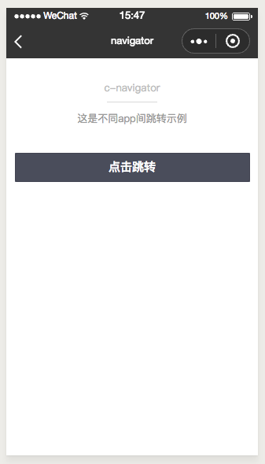

# c-navigator
-------
各app间跳转

### 属性

<table>
  <tr>
    <th width="200px">属性名</th>
    <th>类型</th>
    <th width="60px">必填</th>
    <th>默认值</th>
    <th>说明</th>
  </tr>
  <tr>
    <td>text</td>
    <td>String</td>
    <td>否</td>
    <td>确认</td>
    <td>按钮文案</td>
  </tr>
  <tr>
    <td>size</td>
    <td>String</td>
    <td>否</td>
    <td>none</td>
    <td>按钮尺寸</td>
  </tr>
  <tr>
    <td>type</td>
    <td>String</td>
    <td>否</td>
    <td>blue</td>
    <td>按钮颜色</td>
  </tr>
  <tr>
    <td>disabled</td>
    <td>Boolean</td>
    <td>否</td>
    <td>false</td>
    <td>是否禁用</td>
  </tr>
  <tr>
    <td>btnStyle</td>
    <td>Object</td>
    <td>否</td>
    <td></td>
    <td>自定义button的样式，样式字段采用驼峰或者短横线命名</td>
  </tr>
  <tr>
    <td>textStyle</td>
    <td>Object</td>
    <td>否</td>
    <td></td>
    <td>自定义按钮text 的样式，样式字段采用驼峰或者短横线命名</td>
  </tr>
  <tr>
    <td>disabledStyle</td>
    <td>Object</td>
    <td>否</td>
    <td></td>
    <td>定义button disabled 的样式，样式字段采用驼峰或者短横线命名</td>
  </tr>
  <tr>
    <td>c-bind:onclick</td>
    <td>EventHandle</td>
    <td>否</td>
    <td></td>
    <td>button 点击事件
      <br/>
      返回事件对象：
      <br/>
      event.type= "onclick"
      <br/>
      event.detail = { type, disabled }
    </td>
  </tr>
</table>

### 示例
```html


```




