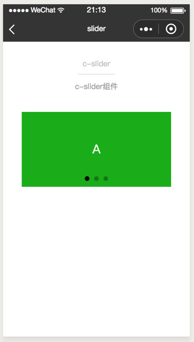

# slider
-------
轮播图。

`<slider>` 标签内可包含多条 `<slider-item>`，适合轮播图展示。

`<slider-item>` 使用文档 [slider-item](/component/base/content/slider-item.html)。

### 属性

<table>
  <tr>
    <th width="200px">属性名</th>
    <th>类型</th>
    <th width="60px">必填</th>
    <th>默认值</th>
    <th>说明</th>
  </tr>
  <tr>
    <td>slider-style</td>
    <td>Object</td>
    <td>否</td>
    <td></td>
    <td>自定义slider的样式，样式字段采用驼峰或者短横线命名</td>
  </tr>
  <tr>
    <td>width</td>
    <td>String</td>
    <td>是</td>
    <td>600px</td>
    <td>定义slider的高度，任何css height 可允许值</td>
  </tr>
  <tr>
    <td>height</td>
    <td>String</td>
    <td>是</td>
    <td>300px</td>
    <td>定义slider的宽度，任何css width 可允许值</td>
  </tr>
  <tr>
    <td>indicator-dots</td>
    <td>Boolean</td>
    <td>否</td>
    <td>true</td>
    <td>是否显示面板指示点</td>
  </tr>
  <tr>
    <td>indicator-color</td>
    <td>String</td>
    <td>否</td>
    <td>rgba(0, 0, 0, .3)</td>
    <td>指示点颜色</td>
  </tr>
  <tr>
    <td>indicator-active-color</td>
    <td>String</td>
    <td>否</td>
    <td>#000000</td>
    <td>当前选中的指示点颜色</td>
  </tr>
  <tr>
    <td>indicator-size</td>
    <td>String</td>
    <td>否</td>
    <td>20px</td>
    <td>指示点大小(在wx下不生效)</td>
  </tr>
  <tr>
    <td>dot-top</td>
    <td>String</td>
    <td>否</td>
    <td>100px</td>
    <td>可调节指示点x轴位置(在wx下不生效)</td>
  </tr>
  <tr>
    <td>autoplay</td>
    <td>Boolean</td>
    <td>否</td>
    <td>false</td>
    <td>是否自动切换</td>
  </tr>
  <tr>
    <td>current</td>
    <td>Number</td>
    <td>否</td>
    <td>0</td>
    <td>当前所在滑块的 index</td>
  </tr>
  <tr>
    <td>interval</td>
    <td>Number</td>
    <td>否</td>
    <td>2000</td>
    <td>自动切换时间间隔 单位/ms</td>
  </tr>
  <tr>
    <td>c-bind:customchange</td>
    <td>EventHandle</td>
    <td>否</td>
    <td></td>
    <td>current 改变时会触发，
        <br/>
        返回事件对象：
        <br/>
        event.detail = {current, source}
    </td>
  </tr>
</table>

### 示例
```html
<template>
<view class="container">
  <view class="slider-wrap">
      <slider
        cstyle="{{sliderStyle}}"
        width="{{sliderWidth}}"
        height="{{sliderHeight}}"
        dot-top="{{dotTop}}"
        indicator-dots="{{indicatorDots}}"
        indicator-color="{{indicatorColor}}"
        indicator-active-color="{{indicatorActiveColor}}"
        indicator-size="{{indicatorSize}}"
        autoplay="{{autoplay}}"
        current="{{current}}"
        interval="{{interval}}"
        c-bind:customchange="onSliderChange"
      >
        <view class="{{'slider-item-' + item}}" c-for="{{background}}" c-for-item="item">
          <text class="item-text">{{item}}</text>
        </view>
      </slider>
  </view>
</view>
</template>
<script>
export default  {
  data: {
    /**
     * slider 配置
     */
    sliderStyle: {},
    sliderWidth: '600px',
    sliderHeight: '300px',
    dotTop: '100px',
    indicatorDots: true,
    indicatorColor: 'rgba(0, 0, 0, .3)',
    indicatorActiveColor: '#000000',
    indicatorSize: '16px',
    autoplay: false,
    current: 0,
    interval: 2000,

    background: ['A', 'B', 'C']
  },
  methods: {
    /**
     * slider 事件
     * 事件对象
     * e.detail
     *
     */
    onSliderChange(e) {
      console.log('slider change: ', e)
    }
  }
}
</script>
<style scoped>
.slider-wrap {
  display: flex;
  flex-direction: column;
  align-items: center;
}
.slider-item-A {
  display: flex;
  width: 600px;
  height: 300px;
  position: relative;
  align-items: center;
  justify-content: center;
  background-color: #1AAD19;
}
.slider-item-B {
  display: flex;
  width: 600px;
  height: 300px;
  position: relative;
  align-items: center;
  justify-content: center;
  background-color: #2782D7;
}
.slider-item-C {
  display: flex;
  width: 600px;
  height: 300px;
  position: relative;
  align-items: center;
  justify-content: center;
  background-color: #F1F1F1;
}
.item-text {
  color: #FFFFFF;
  font-size: 50px;
}
</style>
```


