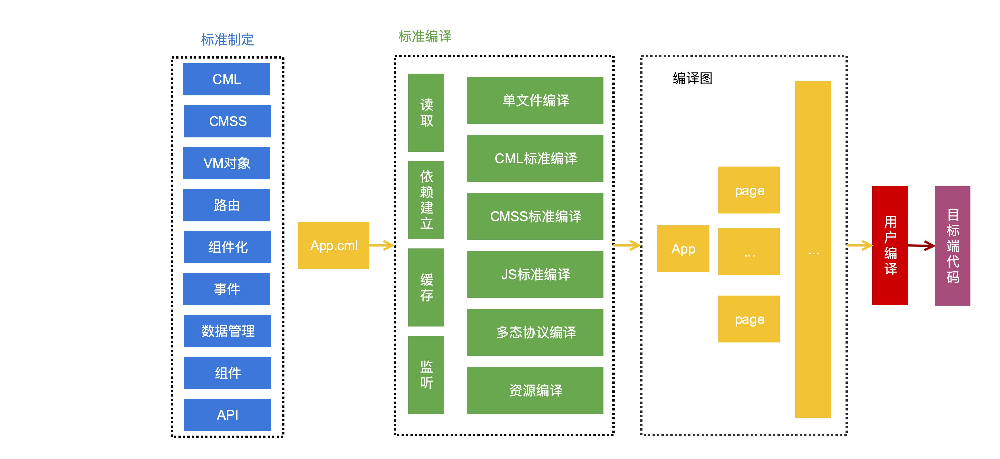

# 如何在chameleon-tool中扩展新端编译

## 1 确定端标识名称
扩展一个新端首先要确定这个端的标识名称，例如微信小程序端为`wx`,百度小程序端为`baidu`，这个标识决定了构建命令的名称、多态协议中的cmlType, 配置对象中的cmlType等。

## 2 配置插件
在项目的chameleon.config.js中配置构建目标端命令时要执行的插件,这里配置的只是插件的名称，后面会讲解插件的写法。配置的字段为`platformPlugin` Object类型,<b>key值为上一步确定的端标识名称</b>,<b>value为要实现的插件的npm包名称</b>, 例如要扩展头条小程序，确定标识为`toutiao`：
```
cml.config.merge({
  platformPlugin: {
    toutiao: 'cml-toutiao-plugin'
  }
})
```
当执行`cml 端标识名称 dev|build`时将走用户插件进行编译。

## 3 扩展新端插件
上一步讲解了如何配置端标识命令对应的用户插件，这里讲一下插件该如何编写。插件是一个`类`，要求是npm包的入口。例如
```
module.exports = class ToutiaoPlugin {
    constructor(options) {
      this.logLevel = 3; // 日志等级
      this.config = { // 默认的配置
        dev: {},
        build: {}
      };
    }
  /**
   * @description 注册命令
   * @param commander 命令对象
   * @param releaseHelper 构建方法
   * */ 
    register(compiler) {
      compiler.hook('compile-App-ALL', function(currentNode) {
      })
      compiler.hook('compile-Page-ALL', function(currentNode) {
      })
      compiler.hook('compile-Component-ALL', function(currentNode) {
      })
      compiler.hook('compile-Module-JS', function(currentNode) {
      })
      compiler.hook('compile-Module-CML', function(currentNode) {
      })
      compiler.hook('compile-Module-CMSS', function(currentNode) {
      })
      compiler.hook('compile-Module-ASSET', function(currentNode) {
      })
      compiler.hook('compile-Module-Other', function(currentNode) {
      })
      compiler.hook('compile-end', function(endTime) {
        // 编译结束可以通过compiler的projectGraph编译图 生成目标端的代码
      })
    }
}
```
扩展新端的编译，chameleon-tool会先进行标准的编译，编译成标准的格式，然后通过hook，交由用户编译。整体流程如下：




插件类的定义如下：
<table>
  <tr><th>类型</th><th>名称</th><th>可选值</th><th>描述</th></tr>
  <tr><td>属性</td><td>logLevel</td><td>0,1,2,3。默认为2</td>
    <td>日志输出等级
      <table>
        <tr><th>日志等级</th><th>输出条件</th></tr>
        <tr><td>error 错误日志</td><td>logLevel >=0</td></tr>
        <tr><td>warn 警告日志</td><td>logLevel >=1</td></tr>
        <tr><td>notice 消息日志</td><td>logLevel >=2</td></tr>
        <tr><td>debug 调试日志</td><td>logLevel >=3</td></tr>
      </table>
    </td>
  </tr>
  <tr><td>属性</td><td>config</td><td></td><td>用于设置当前端构建的默认配置，具体字段参见<a href="https://cmljs.org/doc/framework/config.html#%E5%B9%B3%E5%8F%B0%E5%86%85%E9%85%8D%E7%BD%AE">工程配置</a></td>
  </tr>

  <tr><td>方法</td><td>register</td><td>function(compiler){}</td><td>用于接收compiler编译对象</td>
  </tr>
</table>

## 4 compiler对象
compiler编译对象是编译的核心，提供给用户的`hook`方法，可以对相应的编译节点进行处理。

compiler对象的定义如下：
<table>
  <tr><th>类型</th><th>名称</th><th>数据类型</th><th>描述</th></tr>
  <tr><td>属性</td><td>options</td><td>
  
  {
    cmlType: "当前端标识",
    media: "当前构建类型",
    projectRoot: "当前项目根目录",
    cmlRoot: "chameleon-tool根目录",
    config: "chameleon.config.js中当前的构建配置"
  }</td>
    <td>编译对象的相关配置信息</td>
  </tr>
  <tr><td>属性</td><td>projectGraph</td><td>CMLNode</td><td>编译图的根节点</td>
  </tr>

  <tr>
    <td>方法</td>
    <td>hook</td>
    <td>hook(event: 钩子名称，function: 处理函数) </td>
    <td>用于注册编译过程，进行编译处理</td>
  </tr>
  <tr>
    <td>方法</td>
    <td>resolve</td>
    <td>resolve(start: 源文件地址，request: 引用文件路径) {return '引用文件绝对路径'}</td>
    <td>用于解析源文件中引用文件的绝对路径</td>
  </tr>

  <tr>
    <td>方法</td>
    <td>getRouterConfig</td>
    <td>getRouterConfig(){
    return 项目路由配置对象
  } </td>
    <td>用户可以调用这个方法获取路由配置对象</td>
  </tr>

  <tr>
    <td>方法</td>
    <td>readFileSync</td>
    <td>参数同 fs.readFileSync </td>
    <td>用户可以使用该方法读取文件内容，有缓存处理</td>
  </tr>
   <tr>
    <td>方法</td>
    <td>getPublicPath</td>
    <td>filePath 资源的绝对路径</td>
    <td>返回资源文件的publicPath，用户可以根据该路径决定资源的生成路径</td>
  </tr>

</table>

## 5 CMLNode节点结构
compile对象的`projectGraph`为编译图，编译图节点的数据类型为`CMLNode`,其结构介绍如下：
```
class CMLNode {
  constructor(options = {}) {
    this.ext; // 文件后缀
    this.realPath; // 文件物理地址
    this.nodeType; // App/Page/Component/Module // 节点类型     CML文件分为App/Page/Component  其他的为Module  CML文件中的每一个部分也是一个Node节点
    this.moduleType; // template/style/script/json/asset/other  CML文件的moduleType为null
    this.dependencies = []; // 该节点的直接依赖编译及诶点        app.cml依赖pages.cml pages.cml依赖components.cml js依赖js cmss依赖cmss
    this.devDependencies = []; // 该节点的编译依赖的文件 该文件改动会触发重新编译  但是这个文件本身是不需要单独编译
    this.childrens = []; // 子模块 CML才有子模块
    this.parent; // 父模块 CML文件中的子模块才有
    this.source; // 模块源代码
    this.convert; // AST  JSON
    this.output; // 模块输出  各种过程操作该字段
    this.attrs; // CML/CMSS/JS/JSON模块上的属性
    this.compiled; // 是否经过编译
    this.extra; // 用户可以额外添加的信息
    this.mtime; // 文件修改时间
    this.identifier; // 节点唯一标识 由 nodeType moduleType realPath组成
    Object.keys(options).forEach(key => {
      this[key] = options[key];
    })
  }
}

```
下面对每一个字段进行深入讲解：
<table>
  <tr><th>字段</th><th>说明</th></tr>
  <tr><td>ext</td><td>文件后缀， 例如'.js'</td></tr>
  <tr>
    <td>realPath</td>
    <td>文件的真实路径，包括路径上的参数，例如'/user/demo1/src/assets/img1.png?__inline'</td>
  </tr>
  <tr><td>nodeType</td><td>节点的类型，分为App/Page/Component/Module，其中只有src/app/app.cml类型为App， router.config.json中配置的cml文件为Page，其他的cml文件为Component。非CML文件为Module</td></tr>

  <tr>
    <td>moduleType</td>
      <td>模块类型，当节点的nodeType为App/Page/Component时，其ModuleType为null。
      当节点的nodeType为Module时，根据文件后缀判断moduleType。
        <table>
          <tr>
            <td>后缀</td>
            <td>moduleType值</td>
          </tr>
          <tr>
            <td>/\.css|\.less|\.stylus|\.styls$/</td>
            <td>style</td>
          </tr>
          <tr>
            <td>/\.js|\.interface$/</td>
            <td>script</td>
          </tr>
          <tr>
            <td>/\.json$/</td>
            <td>json</td>
          </tr>
          <tr>
            <td>/\.(png|jpe?g|gif|svg|mp4|webm|ogg|mp3|wav|flac|aac|woff|woff2?|eot|ttf|otf)(\?.*)?$</td>
            <td>asset</td>
          </tr>
          <tr>
            <td>其他后缀</td>
            <td>other</td>
          </tr>
        </table>
    </td>
  </tr>
  <tr>
    <td>dependencies</td><td>节点的直接依赖节点，比如js中require和import语句依赖的文件节点</td>
  </tr>
  <tr>
    <td>devDependencies</td>
    <td>该节点的编译依赖的文件 该文件改动会触发重新编译  但是这个文件本身是不需要单独编译</td>
  </tr>
  <tr>
    <td>childrens</td>
    <td>节点的子节点，只有CML文件有子节点，一个CML的四个部分分为四个子节点</td>
  </tr>
  <tr>
    <td>parent</td>
    <td>节点的父节点，只有CML文件的子节点才有父节点</td>
  </tr>
  <tr>
    <td>source</td>
    <td>节点的源代码</td>
  </tr>
  <tr>
    <td>convert</td>
    <td>标准编译对源码的格式化结果</td>
  </tr>
  <tr>
    <td>output</td>
    <td>节点的最终文件输出，用户可将节点编译结果存放在该字段</td>
  </tr>
  <tr>
    <td>attrs</td>
    <td> moduelType为CML/CMSS/JS/JSON模块上的标签属性，例如CML上的lang="vue"</td>
  </tr>
  <tr>
    <td>compiled</td>
    <td>标识节点是否经过标准编译</td>
  </tr>
  <tr>
    <td>mtime</td>
    <td>节点对应的文件修改时间</td>
  </tr>
  <tr>
    <td>identifier</td>
    <td>节点的唯一标识，由`${nodeType}_${moduleType}_${realPath}`组成</td>
  </tr>
</table>

## Hook
通过插件类的`register`方法可以获取到`compiler编译对象`，`compiler编译对象`的hook方法用于扩展用户自定义的编译。提供了如下hook：
<table>
  <tr><th>钩子名称</th><th>说明</th><th>处理函数参数</th></tr>
  <tr>
    <td>start-run</td>
    <td>编译开始</td>
    <td>function(startTime: 编译开始时间戳 ) {}</td>
  </tr>
  <tr>
    <td>compile-preCML</td>
    <td>编译CML文件节点及其依赖节点之前</td>
    <td>function(currentNode: 当前CML文件节点，nodeType: 当前节点类型 App/Page/Component ) {}</td>
  </tr>
   <tr>
    <td>compile-postCML</td>
    <td>编译CML文件节点及其依赖节点之后</td>
    <td>function(currentNode: 当前CML文件节点，nodeType: 当前节点类型 App/Page/Component ) {}</td>
  </tr>
  
  <tr>
    <td>compile-script</td>
    <td>编译moduleType为script的节点</td>
    <td>function(currentNode: 当前节点 ) {}</td>
  </tr>
  <tr>
    <td>compile-template</td>
    <td>编译moduleType为template的节点, 目前是cml文件的template部分</td>
    <td>function(currentNode: 当前节点 ) {}</td>
  </tr>
  <tr>
    <td>compile-style</td>
    <td>编译moduleType为style的节点</td>
    <td>function(currentNode: 当前节点 ) {}</td>
  </tr>
  <tr>
    <td>compile-asset</td>
    <td>编译moduleType为asset的节点</td>
    <td>function(currentNode: 当前节点 ) {}</td>
  </tr>
  <tr>
    <td>compile-other</td>
    <td>编译moduleType为other的节点</td>
    <td>function(currentNode: 当前节点 ) {}</td>
  </tr>
   <tr>
    <td>end-run</td>
    <td>编译结束</td>
    <td>function(endTime: 编译结束时间戳 ) {}</td>
  </tr>
</table>
