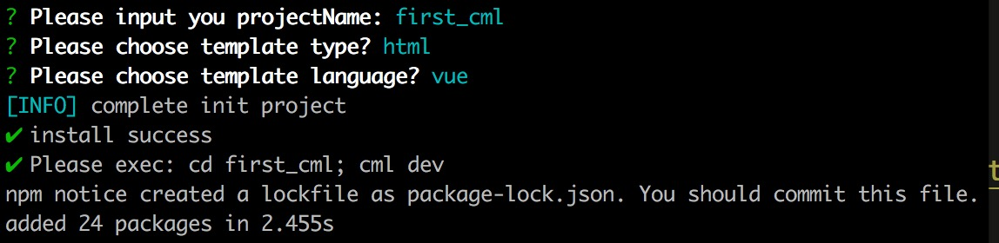

## 安装启动

#### 1 运行环境

##### node && npm
chameleon-tool是chameleon的脚手架工具，其中采用了es6语法，shrinkwrap版本固化等新特性，<b>所以要求node版本>=8.10.0, npm>=5.6.0<b>。
建议安装[nvm](https://github.com/creationix/nvm)管理node版本。


#### 2 全局安装chameleon-tool构建工具

`npm i -g chameleon-tool`

安装成功后，执行 `cml -v` 即可查看当前版本， `cml -h`查看命令行帮助文档。

#### 3 创建项目与启动

- 执行 `cml init project`
- 输入项目名称
- 等待自动执行npm install依赖

<br/>


- 切换到项目根目录执行`cml dev`
- 会自动打开预览界面 预览界面如下：


##### php-cgi

如果web端的项目模板是纯html文件，则不需要安装`php-cgi`。

如果web端项目采用smarty模板，本地调试需要模拟smarty语法，依赖php-cgi对smarty模板进行渲染，需要安装`php-cgi`，<b>如果执行`php-cgi -v` 命令，可以看到版本信息，则证明已经安装，可以跳过php-cgi的安装</b>。

- 方法一 针对mac：
首先确保安装brew，若未安装，参见： https://brew.sh/。
安装后执行 `brew install php@7.1 --with-cgi`
根据安装后的提示，配置环境变量，执行:
```bash
echo 'export PATH="/usr/local/opt/php@7.1/bin:$PATH"' >> ~/.bash_profile
echo 'export PATH="/usr/lcal/opt/php@7.1/sbin:$PATH"' >> ~/.bash_profile
source ~/.bash_profile
```
执行`PHP -v `就可以看到安装的php版本
- 方法二:
针对所有mac和window系统都可以直接百度下载XAMPP，双击安装；等安装成功后需要把XAMPP的bin目录设置到 环境变量里面；
```
echo 'export PATH=/Applications/XAMPP/bin:$PATH' >> ~/.bashrc
source ~/.bashrc
```
window下的xampp的bin目录可能不一样,需要自行查看
