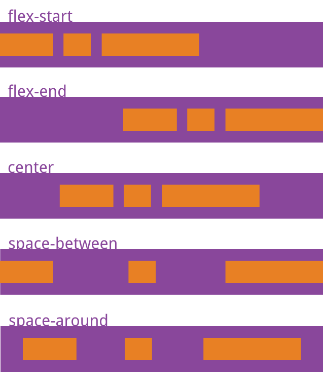
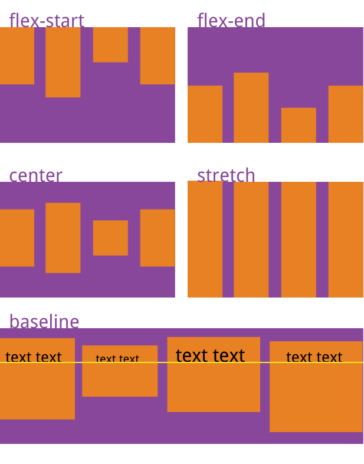
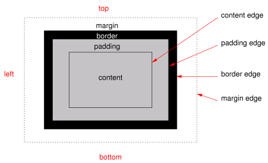
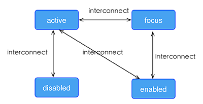

# 通用样式

所有的chameleon组件都支持以下通用样式规则。
##  Flexbox
chameleon 布局模型基于 CSS Flexbox，以便所有页面元素的排版能够一致可预测，同时页面布局能适应各种设备或者屏幕尺寸。<em style="color:red">请勿使用float布局方式</em>

Flexbox 包含 flex 容器和 flex 成员项。如果一个 chameleon 元素可以容纳其他元素，那么它就成为 flex 容器。需要注意的是，flexbox 的老版规范相较新版有些出入，比如是否能支持 wrapping。这些都描述在 W3C 的工作草案中了，你需要注意下新老版本之间的不同。

### Flex 容器
在 chameleon 中，Flexbox 是默认且唯一的布局模型，所以你不需要手动为元素添加 display: flex; 属性。

- flex-direction：

  定义了 flex 容器中 flex 成员项的排列方向。可选值为 row | column，默认值为 column

    - `column`：从上到下排列。
    - `row`：从左到右排列。
- justify-content：

  定义了 flex 容器中 flex 成员项在主轴方向上如何排列以处理空白部分。可选值为 `flex-start | flex-end | center | space-between`，默认值为 flex-start。

    - `flex-start`：是默认值，所有的 flex 成员项都排列在容器的前部；
    - `flex-end`：则意味着成员项排列在容器的后部；
    - `center`：即中间对齐，成员项排列在容器中间、两边留白；
    - `space-between`：表示两端对齐，空白均匀地填充到 flex 成员项之间。
    - `space-around`：每个项目两侧的间隔相等。所以，项目之间的间隔比项目与边框的间隔大一倍。


- align-items：

  定义了 flex 容器中 flex 成员项在纵轴方向上如何排列以处理空白部分。可选值为 stretch | flex-start | center | flex-end，默认值为 stretch。

    - `stretch`： 是默认值，即拉伸高度至 flex 容器的大小；
    - `flex-start`： 则是上对齐，所有的成员项排列在容器顶部；
    - `flex-end`： 是下对齐，所有的成员项排列在容器底部；
    - `center`： 是中间对齐，所有成员项都垂直地居中显示。
    - `baseline`： 项目的第一行文字的基线对齐。


- flex-flow

  说明:

  - flex-flow 属性是 flex-direction 和 flex-wrap 属性的复合属性, 用于设置或检索弹性盒模型对象的子元素排列方式。
  - flex-direction 属性规定灵活项目的方向。
  - flex-wrap 属性规定灵活项目是否拆行或拆列。

  语法:

  ```
  flex-flow: flex-direction flex-wrap;
  ```

### Flex 成员项
flex 属性定义了 flex 成员项可以占用容器中剩余空间的大小。如果所有的成员项设置相同的值 flex: 1，它们将平均分配剩余空间. 如果一个成员项设置的值为 flex: 2，其它的成员项设置的值为 flex: 1，那么这个成员项所占用的剩余空间是其它成员项的2倍。

- flex {number}：值为 number 类型。

### 示例

一个简单的网格布局。
```html
<template>
  <view>
    <view c-for="{{list}}" c-if-index="i" c-if-item="item" class="row">
      <view c-for="{{v}}" c-if-index="k" c-if-item="text"class="item">
        <view>
          <text>{{text}}</text>
        </view>
      </view>
    </view>
  </view>
</template>
<style scoped>
  .item{
    flex:1;
    justify-content: center;
    align-items:center;
    border-width:1;
  }
  .row{
    flex-direction: row;
    height:80cpx;
  }
</style>
<script>
class Index {
  data = {
    list: [
      ['A', 'B', 'C'],
      ['D', 'E', 'F'],
      ['G', 'H', 'I']
    ]
  }
}
export default new Index();
</script>
```


## 盒模型



chameleon 盒模型基于 CSS 盒模型，每个 chameleon 元素都可视作一个盒子。我们一般在讨论设计或布局时，会提到「盒模型」这个概念。

盒模型描述了一个元素所占用的空间。每一个盒子有四条边界：外边距边界 margin edge, 边框边界 border edge, 内边距边界 padding edge 与内容边界 content edge。这四层边界，形成一层层的盒子包裹起来，这就是盒模型大体上的含义。

- `width {length}`：，默认值 0
- `height {length}`：，默认值 0
- `padding {length}`：内边距，内容和边框之间的距离。默认值 0

 可有以下写法:

```markdown
- `padding-left {length}`：，默认值 0
- `padding-right {length}`：，默认值 0
- `padding-top {length}`：，默认值 0
- `padding-bottom {length}`：，默认值 0
```
  支持简写模式：`padding：{length length length length}`
- margin：

 外边距，元素和元素之间的空白距离。值类型为 length，默认值 0

 可有如下写法：

```
- `margin-left {length}`：，默认值 0
- `margin-right {length}`：，默认值 0
- `margin-top {length}`：，默认值 0
- `margin-bottom {length}`：，默认值 0
```
  支持简写模式：`margin:{length length length length}`
- border：
 设定边框，简写方式：`border：1px solid #ff0000;`

 可有如下写法：

```markdown
- border-style：

设定边框样式，值类型为 string，可选值为 `solid | dashed | dotted`，默认值 solid

可有如下写法：

    - `border-left-style {string}`：可选值为 `solid | dashed | dotted`，默认值 solid
    - `border-top-style {string}`：可选值为 `solid | dashed | dotted`，默认值 solid
    - `border-right-style {string}`：可选值为 `solid | dashed | dotted`，默认值 solid
    - `border-bottom-style {string}`：可选值为 `solid | dashed | dotted`，默认值 solid
- border-width {length}：

 设定边框宽度，非负值, 默认值 0

 可有如下写法：

    - `border-left-width {length}`：，非负值, 默认值 0
    - `border-top-width {length}`：，非负值, 默认值 0
    - `border-right-width {length}`：，非负值, 默认值 0
    - `border-bottom-width {length}`：，非负值, 默认值 0
- border-color {color}：

 设定边框颜色，默认值 `#000000`

 可有如下写法：

    - `border-left-color {color}`：，默认值 #000000
    - `border-top-color {color}`：，默认值 #000000
    - `border-right-color {color}`：，默认值 #000000
    - `border-bottom-color {color}`：，默认值 #000000
- border-radius {length}：

 设定圆角，默认值 0

 可有如下写法：

    - `border-bottom-left-radius {length}`：，非负值, 默认值 0
    - `border-bottom-right-radius {length}`：，非负值, 默认值 0
    - `border-top-left-radius {length}`：，非负值, 默认值 0
    - `border-top-right-radius {length}`：，非负值, 默认值 0
```

** 注意 **

chameleon 盒模型的 box-sizing 默认为 border-box，即盒子的宽高包含内容、内边距和边框的宽度，不包含外边距的宽度。

目前在 <image> 组件上尚无法只定义一个或几个角的 border-radius。比如你无法在这两个组件上使用 `border-top-left-radius`。该约束只对 iOS 生效，Android 并不受此限制。

尽管 overflow:hidden 在 Android 上是默认行为，但只有下列条件都满足时，一个父 view 才会去 clip 它的子 view。这个限制只对 Android 生效，iOS 不受影响。

- 父view是div, a, cell, refresh 或 loading。
- 系统版本是 Android 4.3 或更高。
- 系统版本不是 Andorid 7.0。
- 父 view 没有 background-image 属性或系统版本是 Android 5.0 或更高。

### 示例：
```html
<template>
  <view>
    <image  style="width: 400cpx; height: 200cpx; margin-left: 20cpx;" src="https://g.alicdn.com/mtb/lab-zikuan/0.0.18/weex/weex_logo_blue@3x.png"></image>
  </view>
</template>
```
##  定位
chameleon 支持 position 定位，用法与 CSS position 类似。为元素设置 position 后，可通过 top、right、bottom、left 四个属性设置元素坐标。

- position {string}：

  设置定位类型。可选值为 `relative | absolute | fixed | sticky`，默认值为 relative。

    - `relative` 是默认值，指的是相对定位；
    - `absolute` 是绝对定位，以元素的容器作为参考系；
    - `fixed` 保证元素在页面窗口中的对应位置显示；
    - `sticky` 指的是仅当元素滚动到页面之外时，元素会固定在页面窗口的顶部。
- `top {number}`：距离上方的偏移量，默认为 0。
- `bottom {number}`：距离下方的偏移量，默认为 0。
- `left {number}`：距离左方的偏移量，默认为 0。
- `right {number}`：距离右方的偏移量，默认为 0。

### 示例
```html
<template scoped>
  <view class="wrapper">
    <view class="box box1">
    </view>
    <view class="box box2">
    </view>
    <view class="box box3">
    </view>
  </view>
</template>
<style>
.wrapper {
  position: absolute;
  top: 0;
  right: 0;
  bottom: 0;
  left: 0;
  background-color: #cccccc;
}
.box {
  width: 400cpx;
  height: 400cpx;
  position: absolute;
}
.box1 {
  top: 0;
  left: 0;
  background-color: #ff0000;
}
.box2 {
  top: 150cpx;
  left: 150cpx;
  background-color: #0055dd;
}
.box3 {
  top: 300cpx;
  left: 300cpx;
  background-color: #00ff49;
}
</style>
```
##  transform
transform 属性向元素应用 2D 转换。该属性允许我们对元素进行旋转、缩放、移动或倾斜。

目前支持的 transform 声明格式:

- `translate( <number/percentage> [, <number/percentage>]?)`
- `translateX( <number/percentage> )`
- `translateY( <number/percentage> )`
- `scale( )`
- `scaleX( )`
- `scaleY( )`
- `rotate( <angle/degree> )`
- `rotateX( <angle/degree> ) `
- `rotateY( <angle/degree> ) `
- `perspective( )`
- `transform-origin: number/percentage/keyword(top/left/right/bottom)`

###  示例
```html
<template>
  <view class="wrapper">
    <view class="transform">
     <text class="title">Transformed element</text>
    </view>
  </view>
</template>

<style>
.transform {
  align-items: center;
  transform: translate(150cpx,200cpx) rotate(20deg);
  transform-origin: 0 -250cpx;
  border-color:red;
  border-width:2cpx;
}
.title {font-size: 48cpx;}
</style>
```
##  transition
现在您可以在CSS中使用transition属性来提升您应用的交互性与视觉感受，transition中包括布局动画，即LayoutAnimation，现在布局产生变化的同时也能使用transition带来的流畅动画。transition允许CSS的属性值在一定的时间区间内平滑地过渡。

### 参数
- transition-property:允许过渡动画的属性名，设置不同样式transition效果的键值对，默认值为空，表示不执行任何transition，下表列出了所有合法的参数属性：
<table>
  <tr>
    <th>参数名</th>
    <th>描述</th>
  </tr>
  <tr>
    <td>width</td>
    <td>transition过渡执行的时候是否组件的宽度参与动画</td>
  </tr>
  <tr>
    <td>height</td>
    <td>transition过渡执行的时候是否组件的高度参与动画</td>
  </tr>
  <tr>
    <td>top</td>
    <td>transition过渡执行的时候是否组件的顶部距离参与动画</td>
  </tr>
  <tr>
    <td>bottom</td>
    <td>transition过渡执行的时候是否组件的底部距离参与动画</td>
  </tr>
  <tr>
    <td>left</td>
    <td>transition过渡执行的时候是否组件的左侧距离参与动画</td>
  </tr>
  <tr>
    <td>right</td>
    <td>transition过渡执行的时候是否组件的右侧距离参与动画</td>
  </tr>
  <tr>
    <td>backgroundColor</td>
    <td>transition过渡执行的时候是否组件的背景颜色参与动画</td>
  </tr>
  <tr>
    <td>opacity</td>
    <td>transition过渡执行的时候是否组件的不透明度参与动画</td>
  </tr>
  <tr>
    <td>transform</td>
    <td>transition过渡执行的时候是否组件的变换类型参与动画</td>
  </tr>
</table>
- `transition-duration`:指定transition过渡的持续时间 (单位是毫秒)，默认值是 0，表示没有动画效果。

- `transition-delay`:指定请求transition过渡操作到执行transition过渡之间的时间间隔 (单位是毫秒或者秒)，默认值是 0，表示没有延迟，在请求后立即执行transition过渡。

- `transition-timing-function`:描述transition过渡执行的速度曲线，用于使transition过渡更为平滑。默认值是 ease。下表列出了所有合法的属性：
<table>
  <tr>
    <th>属性名</th>
    <th>描述</th>
  </tr>
  <tr>
    <td>ease</td>
    <td>transition过渡逐渐变慢的过渡效果</td>
  </tr>
  <tr>
    <td>ease-in</td>
    <td>transition过渡慢速开始，然后变快的过渡效果</td>
  </tr>
  <tr>
    <td>ease-out</td>
    <td>transition过渡快速开始，然后变慢的过渡效果</td>
  </tr>
  <tr>
    <td>ease-in-out</td>
    <td>transition过渡慢速开始，然后变快，然后慢速结束的过渡效果</td>
  </tr>
  <tr>
    <td>linear</td>
    <td>transition过渡以匀速变化</td>
  </tr>
  <tr>
    <td>cubic-bezier(x1, y1, x2, y2)</td>
    <td>使用三阶贝塞尔函数中自定义transition变化过程，函数的参数值必须处于 0 到 1 之间。更多关于三次贝塞尔的信息请参阅 cubic-bezier 和 Bézier curve.</td>
  </tr>
</table>

### 示例
```html
<style scoped>
.panel {
  margin: 10cpx;
  top:10cpx;
  align-items: center;
  justify-content: center;
  border: solid;
  border-radius: 10cpx;

  transition-property: width,height,backgroundColor;
  transition-duration: 0.3s;
  transition-delay: 0s;
  transition-timing-function: cubic-bezier(0.25, 0.1, 0.25, 1.0);
}
</style>
```
###  伪类
chameleon支持四种伪类：active, focus, disabled, enabled

所有组件都支持 active, 但只有 input 组件和 textarea 组件支持 focus, enabled, disabled。

#### 规则
- 同时生效的时候，优先级高覆盖优先级低

    - 例如：input:active:enabled 和 input:active 同时生效，前者覆盖后者
- 互联规则如下所示



### 示例
```html
<template>
  <view class="wrapper">
    <image :src="logoUrl" class="logo"></image>
  </view>
</template>

<style scoped>
  .wrapper {
    align-items: center;
    margin-top: 120cpx;
  }
  .title {
    font-size: 48cpx;
  }
  .logo {
    width: 360cpx;
    height: 82cpx;
    background-color: red;
  }
  .logo:active {
    width: 180cpx;
    height: 82cpx;
    background-color: green;
  }
</style>

<script>
class Index {
  props = {
    logoUrl: {
      default: 'https://alibaba.github.io/weex/img/weex_logo_blue@3x.png'
    },
    target: {
      default: 'World'
    }
  }
  methods = {
    update(e) {
      this.target = 'Weex';
    }
  }
}
export default new Index();
</script>
```
## 线性渐变
chameleon支持线性渐变背景。

所有组件均支持线性渐变。

###  使用
你可以通过 background-image属性创建线性渐变。
```html
background-image: linear-gradient(to top,#a80077,#66ff00);
```
目前暂不支持 radial-gradient（径向渐变）。

chameleon 目前只支持两种颜色的渐变，渐变方向如下：

- to right
  从左向右渐变
- to left
  从右向左渐变
- to bottom
  从上到下渐变
- to top
  从下到上渐变
- to bottom right
  从左上角到右下角
- to top left
  从右下角到左上角

## Note
- background-image 优先级高于 background-color，这意味着同时设置 background-image 和 background-color，background-color 被覆盖。

### 示例

```html
<template>
  <scroller style="background-color: #3a3a3a">
    <view class="container1" style="background-image:linear-gradient(to right,#a80077,#66ff00);">
      <text class="direction">to right</text>
    </view>
    <view class="container1" style="background-image:linear-gradient(to left,#a80077,#66ff00);">
      <text class="direction">to left</text>
    </view>
    <view class="container1" style="background-image:linear-gradient(to bottom,#a80077,#66ff00);">
      <text class="direction">to bottom</text>
    </view>
    <view class="container1" style="background-image:linear-gradient(to top,#a80077,#66ff00);">
      <text class="direction">to top</text>
    </view>
    <view style="flex-direction: row;align-items: center;justify-content: center">
      <view class="container2" style="background-image:linear-gradient(to bottom right,#a80077,#66ff00);">
        <text class="direction">to bottom right</text>
      </view>
      <view class="container2" style="background-image:linear-gradient(to top left,#a80077,#66ff00);">
        <text class="direction">to top left</text>
      </view>
    </view>
  </scroller>
</template>
<style>
  .container1 {
    margin: 10cpx;
    width: 730cpx;
    height: 200cpx;
    align-items: center;
    justify-content: center;
    border: solid;
    border-radius: 10cpx;
  }

  .container2 {
    margin: 10cpx;
    width: 300cpx;
    height: 300cpx;
    align-items: center;
    justify-content: center;
    border: solid;
    border-radius: 10cpx;
  }

  .direction {
    font-size: 40cpx;
    color: white;
  }
</style>
```

## 阴影(box-shadow)
chameleon 支持阴影属性：`active, focus, disabled, enabled inset(可选),offset-x,offset-y, blur-radius,color`

**注意**
- box-shadow仅仅支持iOS

### 示例

```html
<template>
  <view class="wrapper">
    <view style="width:400cpx; height:60cpx;background-color: #FFE4C4; box-shadow:20cpx  10cpx rgb(255, 69, 0);">
      <text class="title" style="text-align: center">Hello {{target}}</text>
    </view>
    <view style="margin-top: 80cpx;width:400cpx; height:60cpx;background-color: #FFE4C4; box-shadow: 20cpx  10cpx 5cpx rgba(255, 69, 0, 0.8);">
      <text class="title" style="text-align: center">Hello {{target}}</text>
    </view>
    <view style="margin-top: 80cpx;width:400cpx; height:60cpx;background-color: #FFE4C4; box-shadow:inset 20cpx  10cpx 5cpx rgba(255, 69, 0, 0.8);">
      <text class="title" style="text-align: center">Hello {{target}}</text>
    </view>
    <view style="margin-top: 80cpx;width:400cpx; height:60cpx;background-color: #FFE4C4; box-shadow:inset 20cpx  10cpx 5cpx rgb(255, 69, 0);">
      <text class="title" style="text-align: center">Hello {{target}}</text>
    </view>
    <view style="margin-top: 80cpx;width:400cpx; height:60cpx;background-color: #FFE4C4; box-shadow:20cpx  10cpx 5cpx black;">
      <text class="title" style="text-align: center">Hello {{target}}</text>
    </view>
    <view style="margin-top: 80cpx;width:400cpx; height:60cpx;background-color: #FFE4C4; box-shadow:20cpx  10cpx 5cpx #008B00;">
      <text class="title" style="text-align: center">Hello {{target}}</text>
    </view>
  </view>
</template>

<style scoped>
  .wrapper {align-items: center; margin-top: 120cpx;}
  .title {font-size: 48cpx;}
</style>

<script>
module.exports = {
  data: {
      logoUrl: 'https://alibaba.github.io/weex/img/weex_logo_blue@3x.png',
      target: 'World'
    };
};
</script>
```
## 其他基本样式
- `opacity {number}`：取值范围为 [0, 1] 区间。默认值是 1，即完全不透明；0 是完全透明；0.5 是 50% 的透明度。
- `background-color {color}`：设定元素的背景色，可选值为色值，支持RGB（ `rgb(255, 0, 0)` ）；RGBA（ `rgba(255, 0, 0, 0.5)` ）；十六进制（ `#ff0000` ）；精简写法的十六进制（ `#f00` ）；色值关键字（red），默认值是 transparent 。

注意：[色值的关键字列表](./colorname_list.html)

## 上手样式
如果对于样式写法需要更多上手参考，可参考每个组件的文档中，都有常见的例子可供参考。

你可以按照以下步骤来规划 chameleon 页面的样式。

- 全局样式规划：将整个页面分割成合适的模块。
- flex 布局：排列和对齐页面模块。
- 定位盒子：定位并设置偏移量。
- 细节样式处理：增加特定的具体样式。
